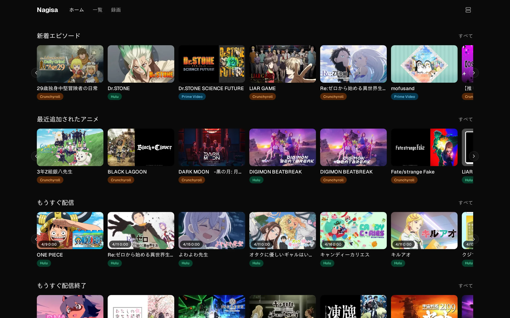
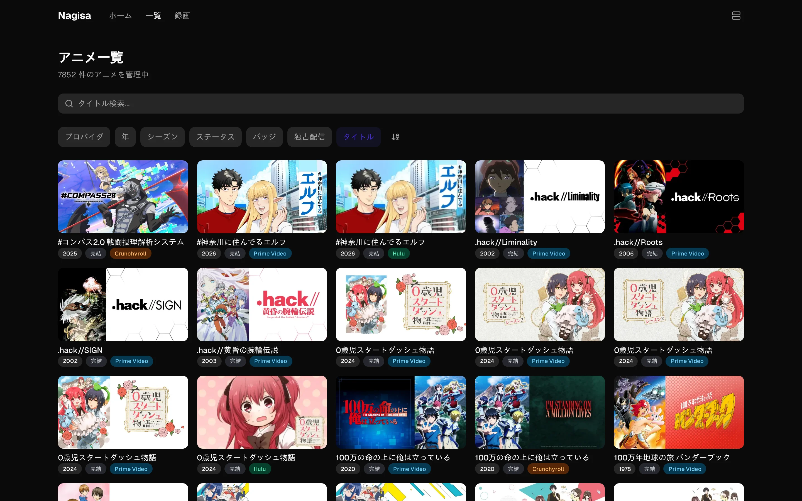
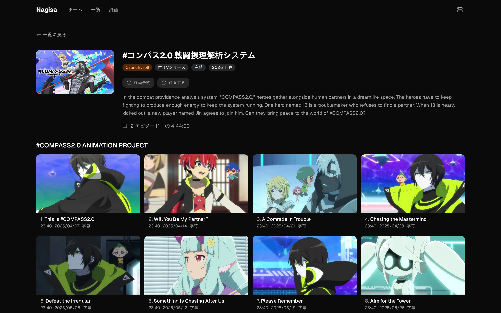
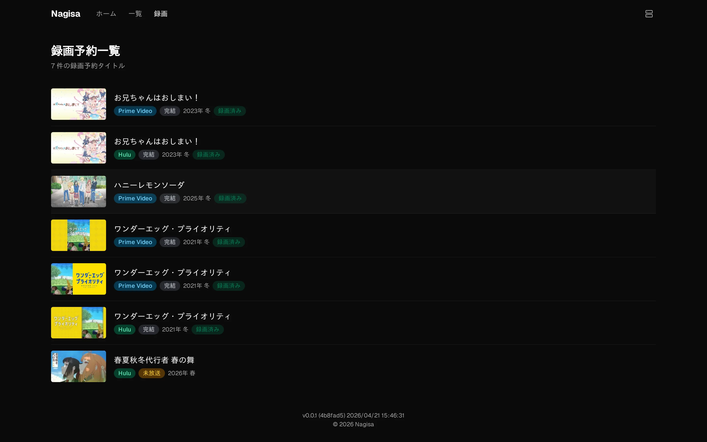
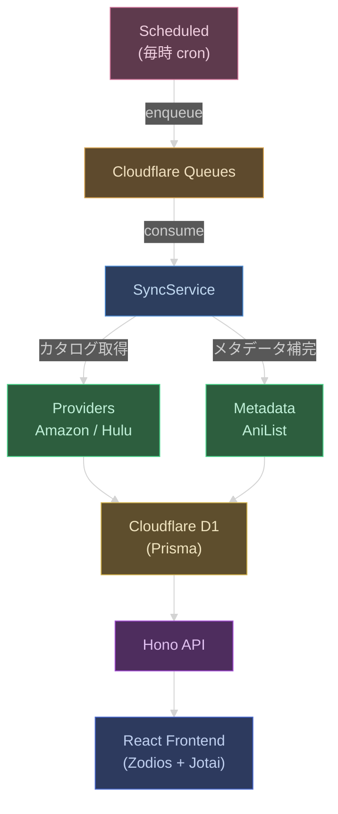
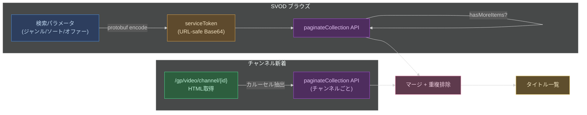
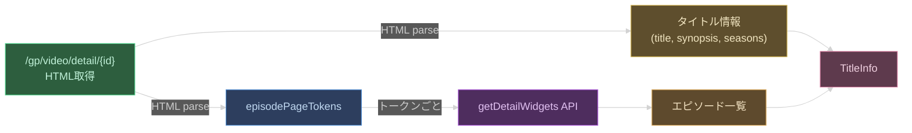
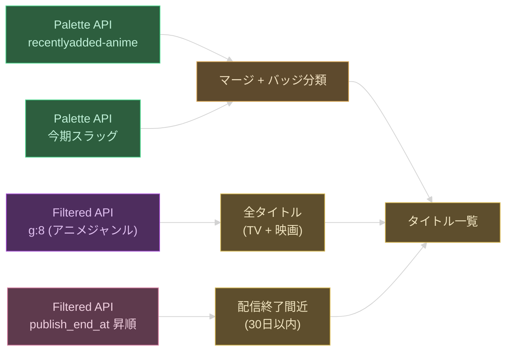
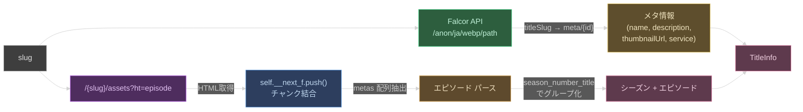

# Nagisa WebUI — 録画管理アプリ

配信サービスの今期アニメを管理し、録画状況を追跡するアプリ。

> **[English README](README.md)**

## スクリーンショット

<table>
  <tr>
    <td><strong>ホーム</strong></td>
    <td><strong>一覧</strong></td>
  </tr>
  <tr>
    <td></td>
    <td></td>
  </tr>
  <tr>
    <td><strong>アニメ詳細</strong></td>
    <td><strong>録画</strong></td>
  </tr>
  <tr>
    <td></td>
    <td></td>
  </tr>
</table>

## 対応配信サービス

| サービス | 状態 | 備考 |
|---------|------|------|
| Amazon Prime Video | 対応済み | サブスクリプションチャンネル (dアニメストア, アニメタイムズ, 東映アニメチャンネル) 含む |
| Hulu | 対応済み | Hulu Japan |
| Netflix | 対応予定 | [docs/features/netflix-provider.md](docs/features/netflix-provider.md) 参照 |

> [!NOTE]
> 録画機能を利用するには [Nagisa Backend](https://github.com/qtmleap/nagisa) と各配信サービスの有効なサブスクリプションが必要です。

## 機能

### データ収集 (バックエンド自動同期)

- **プロバイダスクレイピング** — Amazon Prime Video / Hulu のアニメカタログを毎時自動取得
- **AniList 識別** — 取得したタイトルを AniList GraphQL API で照合し、アニメ作品として識別 (50件バッチ処理)
- **メタデータ補完** — AniList から放送ステータス・放送年・クールなどのメタデータを付与
- **差分同期** — 既存データと比較し、新規シーズン・エピソードのみを追加 (重複なし)
- **キューベース処理** — Cloudflare Queues による非同期メッセージ処理 (fetch → update の2段階)

### API

- `GET /api/anime` — アニメ一覧 (ページネーション・フィルタ・ソート・検索)
- `GET /api/anime/:id` — アニメ詳細 (シーズン・エピソード含む)
- `PATCH /api/anime/:id` — 録画予約 / 録画済みフラグ更新
- `POST /api/anime/:id/record` — 外部バックエンドへの録画リクエスト送信
- `GET /api/recordings` — 録画済みエピソード一覧
- `PUT /api/recordings` — エピソード録画状態更新
- `PUT /api/recordings/bulk` — 一括録画状態更新
- OpenAPI ドキュメント (`/docs`, `/openapi.json`)

### フロントエンド

- **アニメ一覧** (`/`) — カード形式の一覧表示、プロバイダ・年・クール・ステータスでのフィルタリング、タイトル検索、ソート切替、ページネーション
- **アニメ詳細** (`/anime/:id`) — ヒーロー画像付きの詳細ページ、シーズン・エピソードのグリッド表示、録画予約トグル、録画リクエスト送信
- **録画一覧** (`/recordings`) — 録画予約済みアニメの専用ビュー

## 技術スタック

- [Vite](https://vite.dev/) - ビルドツール
- [React](https://react.dev/) - UI ライブラリ
- [TanStack Router](https://tanstack.com/router) - 型安全なファイルベースルーター
- [Tailwind CSS](https://tailwindcss.com/) - スタイリング
- [shadcn/ui](https://ui.shadcn.com/) - UI コンポーネント
- [Hono](https://hono.dev/) + [Zod OpenAPI](https://github.com/honojs/middleware/tree/main/packages/zod-openapi) - API フレームワーク
- [Cloudflare Workers](https://workers.cloudflare.com/) + [D1](https://developers.cloudflare.com/d1/) + [Queues](https://developers.cloudflare.com/queues/) - エッジランタイム・データベース・非同期キュー
- [Prisma](https://www.prisma.io/) + [@prisma/adapter-d1](https://www.prisma.io/docs/orm/overview/databases/cloudflare-d1) - ORM
- [Zodios](https://www.zodios.org/) - 型安全な API クライアント
- [Zod](https://zod.dev/) - バリデーション
- [Jotai](https://jotai.org/) - 状態管理
- [Bun](https://bun.sh/) - ランタイム / パッケージマネージャー
- [TypeScript](https://www.typescriptlang.org/)
- [Biome](https://biomejs.dev/) - Linter / Formatter

## アーキテクチャ



### データ同期フロー

1. **Scheduled** — 毎時 Cron で `hulu` / `amazon` の fetch メッセージを Queue に enqueue
2. **Queue Consumer** — バッチでメッセージを消費し SyncService に委譲
3. **Provider** — Amazon / Hulu のカタログ・詳細ページをスクレイピング
4. **Metadata** — AniList GraphQL でメタデータを補完
5. **Upsert** — Prisma 経由で D1 に Anime / Season / Episode を upsert

### Prime Video のデータ取得

#### タイトル一覧

検索パラメータ (ジャンルフィルタ・ソート順・オファータイプ等) を protobuf でエンコードし、URL-safe Base64 に変換して `serviceToken` を自前生成する。HTML パースは不要で、`paginateCollection` API を直接呼び出す。serviceToken のフォーマットやパラメータの詳細は [docs/features/amazon-browse-urls.md](docs/features/amazon-browse-urls.md) を参照。

1. 軽量ページからセッション Cookie を取得
2. 検索パラメータを protobuf エンコードして `serviceToken` を生成
3. `paginateCollection` API を順次呼び出し、`startIndex` を進めて `hasMoreItems: false` になるまで全ページ取得

新着取得時は2つのソースを並列取得してマージする:
- **SVOD ブラウズ** — 配信開始日順のアニメタイトルから `NEW_EPISODE` / `RECENTLY_ADDED` バッジでフィルタ
- **サブスクリプションチャンネル** — dアニメストア・アニメタイムズ・東映アニメチャンネルの「新着」カルーセルを取得



#### タイトル詳細

詳細ページ (`/gp/video/detail/{contentId}`) の HTML を取得し、`<script type="application/json">` から以下を抽出する:

- タイトル名、あらすじ、エンティティタイプ (movie/tv)、レーティング、画像URL
- シーズン一覧 (seasonId, displayName, seasonNumber)
- エピソードリストのウィジェットトークン (`episodePageTokens`)

エピソード情報は `getDetailWidgets` API をトークンごとに呼び出して取得する。複数シーズンの場合は各シーズンの詳細ページを追加取得してトークンを得る。



### Hulu のデータ取得

#### タイトル一覧

取得カテゴリに応じて2つの API を使い分ける:

- **Palette API** (`/api/v2/palettes/{slug}/vod/objects`) — スラッグ指定で一覧取得。新着取得時は `recentlyadded-anime` + 今期スラッグ (例: `april-june-quarter-anime26`) を併用し、slug で重複排除。バッジは `NEW_EPISODE` (新エピソードあり) / `RECENTLY_ADDED` / `COMING_SOON` に分類
- **Filtered API** (`/api/v2/filtered`) — 全件取得時は `g:8` (アニメジャンル) フィルタで TV + 映画を週間人気順に取得。配信終了間近は `publish_end_at` 昇順で 30 日以内のタイトルを打ち切り取得

いずれも `from`/`to` パラメータで50件ずつページネーションし、`total_count` に達するまで再帰的に取得する。



#### タイトル詳細

2つのデータソースを並列で取得しマージする:

- **Falcor JSON Graph API** (`/anon/ja/webp/path`) — slug をキーにタイトルのメタ情報 (name, description, thumbnailUrl, service) を取得。`titleSlug` パスで slug から内部IDへの解決を Falcor 側で行う
- **RSC (React Server Component) ペイロード** — エピソードページ (`/{slug}/assets?ht=episode`) の HTML から `self.__next_f.push()` チャンクを結合し、`"metas"` 配列を抽出してエピソード情報をパースする。エピソードは `season_number_title` でシーズンにグループ化する



## セットアップ

```bash
bun install
```

## 開発

```bash
bun run dev
```

## ビルド

```bash
bun run build
```

## デプロイ

```bash
bun run deploy
```

`CLOUDFLARE_ENV` 環境変数でデプロイ先を指定できます（デフォルト: `staging`）。

## Lint / 型チェック

```bash
bunx tsc -b --noEmit        # 型チェック
bunx biome check src/        # lint + format チェック
```

## テスト

```bash
bun test
```

テストスイート: Amazon プロバイダ、Hulu プロバイダ、タイトルパーサー

## プロジェクト構成

```
prisma/
├── schema.prisma               # Prisma スキーマ (Anime, Season, Episode)
└── migrations/                 # D1 マイグレーション
src/
├── index.ts                    # Hono エントリーポイント (fetch, scheduled, queue)
├── queue.ts                    # Cloudflare Queue consumer
├── scheduled.ts                # Cron trigger (毎時プロバイダ同期)
├── lib/
│   ├── db.ts                   # PrismaClient + D1 Adapter 初期化
│   ├── sync.ts                 # 同期サービス (fetch → enrich → upsert)
│   ├── merge.ts                # データマージロジック
│   ├── title-parser.ts         # アニメタイトル解析
│   ├── html-parser.ts          # HTML パーサーヘルパー
│   ├── image.ts                # 画像処理
│   ├── logger.ts               # ロガー
│   ├── metadata/               # メタデータ連携
│   │   ├── base.ts             # 抽象エンリッチャー
│   │   ├── tmdb.ts             # TMDB API
│   │   ├── anilist.ts          # AniList GraphQL
│   │   └── index.ts            # ルーター
│   └── providers/              # プロバイダモジュール
│       ├── base.ts             # 抽象プロバイダ
│       ├── amazon/             # Amazon Prime Video
│       │   ├── browse.ts
│       │   ├── channel.ts
│       │   ├── detail.ts
│       │   ├── protobuf.ts
│       │   └── index.ts
│       └── hulu/               # Hulu
│           ├── browse.ts
│           ├── detail.ts
│           ├── rsc-parser.ts
│           └── index.ts
├── routes/                     # Backend API ルート
│   ├── anime.ts                # /api/anime
│   └── recordings.ts           # /api/recordings
├── schemas/                    # Zod スキーマ (*.dto.ts)
│   ├── anime.dto.ts
│   ├── recording.dto.ts
│   ├── message.dto.ts          # Queue メッセージ (tagged union)
│   └── providers/
│       ├── common.dto.ts
│       ├── amazon.dto.ts
│       ├── hulu.dto.ts
│       └── metadata.dto.ts
└── app/                        # Frontend (React)
    ├── main.tsx
    ├── index.css
    ├── lib/
    │   ├── api.ts              # Zodios クライアント
    │   ├── atoms.ts            # Jotai atoms
    │   ├── constants.ts
    │   └── utils.ts
    ├── hooks/
    │   └── use-paginated-fetch.ts
    ├── components/
    │   ├── ui/                 # shadcn/ui primitives
    │   ├── anime-badges.tsx
    │   ├── loading-spinner.tsx
    │   ├── page-transition.tsx
    │   └── smart-pagination.tsx
    └── routes/                 # TanStack Router (ディレクトリ分離)
        ├── __root.tsx          # ルートレイアウト
        ├── index.tsx           # / アニメ一覧
        ├── anime/$id/
        │   └── index.tsx       # /anime/:id 詳細
        ├── recordings/
        │   └── index.tsx       # /recordings 録画一覧
        └── -components/        # ルート共有コンポーネント
            ├── anime-card.tsx
            ├── search-bar.tsx
            └── filter-popover.tsx
```
