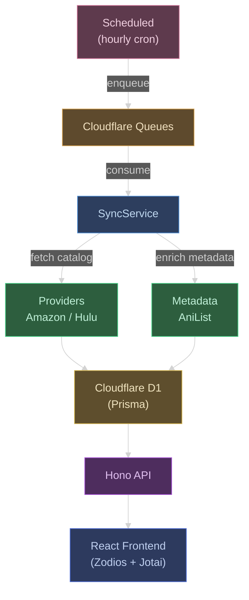
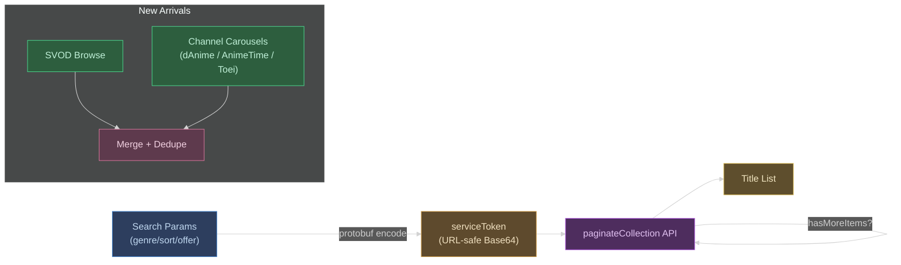
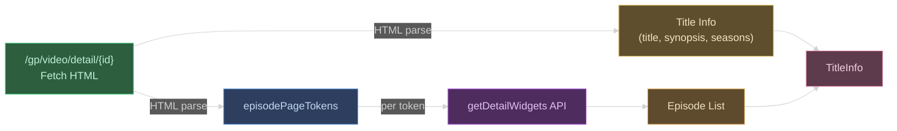
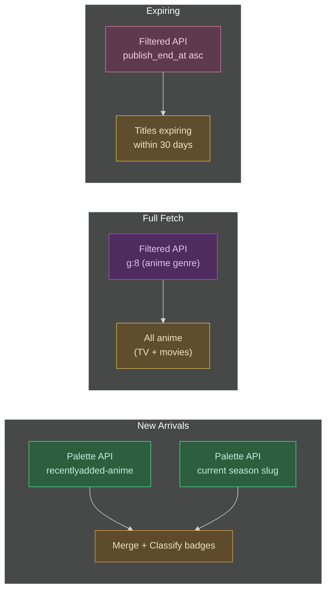
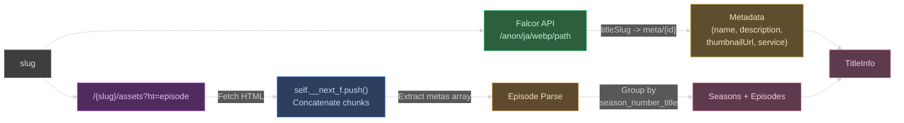

# Nagisa WebUI — Recording Manager

An app for managing and tracking anime recordings from streaming services.

> **[日本語版 README はこちら](README.ja.md)**

## Supported Streaming Services

| Service | Status | Notes |
|---------|--------|-------|
| Amazon Prime Video | Supported | Including subscription channels (d Anime Store, Anime Times, Toei Animation) |
| Hulu | Supported | Hulu Japan |
| Netflix | Planned | See [docs/features/netflix-provider.md](docs/features/netflix-provider.md) |

## Features

### Data Collection (Automated Backend Sync)

- **Provider Scraping** — Automatically fetches anime catalogs from Amazon Prime Video / Hulu every hour
- **AniList Identification** — Matches fetched titles against the AniList GraphQL API to identify anime (50-item batch processing)
- **Metadata Enrichment** — Attaches metadata such as airing status, year, and season from AniList
- **Differential Sync** — Compares with existing data and adds only new seasons/episodes (no duplicates)
- **Queue-Based Processing** — Asynchronous message processing via Cloudflare Queues (fetch → update, two-stage pipeline)

### API

- `GET /api/anime` — Anime list (pagination, filters, sorting, search)
- `GET /api/anime/:id` — Anime details (including seasons and episodes)
- `PATCH /api/anime/:id` — Update recording reservation / recorded flags
- `POST /api/anime/:id/record` — Send recording request to external backend
- `GET /api/recordings` — List of recorded episodes
- `PUT /api/recordings` — Update episode recording status
- `PUT /api/recordings/bulk` — Bulk update recording status
- OpenAPI documentation (`/docs`, `/openapi.json`)

### Frontend

- **Anime List** (`/`) — Card-based list view with filtering by provider, year, season, and status; title search; sort toggle; pagination
- **Anime Detail** (`/anime/:id`) — Detail page with hero image, season/episode grid, recording reservation toggle, recording request submission
- **Recordings** (`/recordings`) — Dedicated view for anime with recording reservations

## Tech Stack

- [Vite](https://vite.dev/) - Build tool
- [React](https://react.dev/) - UI library
- [TanStack Router](https://tanstack.com/router) - Type-safe file-based router
- [Tailwind CSS](https://tailwindcss.com/) - Styling
- [shadcn/ui](https://ui.shadcn.com/) - UI components
- [Hono](https://hono.dev/) + [Zod OpenAPI](https://github.com/honojs/middleware/tree/main/packages/zod-openapi) - API framework
- [Cloudflare Workers](https://workers.cloudflare.com/) + [D1](https://developers.cloudflare.com/d1/) + [Queues](https://developers.cloudflare.com/queues/) - Edge runtime, database, async queues
- [Prisma](https://www.prisma.io/) + [@prisma/adapter-d1](https://www.prisma.io/docs/orm/overview/databases/cloudflare-d1) - ORM
- [Zodios](https://www.zodios.org/) - Type-safe API client
- [Zod](https://zod.dev/) - Validation
- [Jotai](https://jotai.org/) - State management
- [Bun](https://bun.sh/) - Runtime / package manager
- [TypeScript](https://www.typescriptlang.org/)
- [Biome](https://biomejs.dev/) - Linter / Formatter

## Architecture



### Data Sync Flow

1. **Scheduled** — Hourly cron enqueues `hulu` / `amazon` fetch messages to the Queue
2. **Queue Consumer** — Consumes messages in batches, delegates to SyncService
3. **Provider** — Scrapes catalogs and detail pages from Amazon / Hulu
4. **Metadata** — Enriches with metadata via AniList GraphQL
5. **Upsert** — Upserts Anime / Season / Episode into D1 via Prisma

### Prime Video Data Fetching

#### Title List

Generates a `serviceToken` by protobuf-encoding search parameters (genre filter, sort order, offer type, etc.) and converting to URL-safe Base64. This token is passed directly to the `paginateCollection` API without any HTML parsing. For details on the serviceToken format and parameters, see [docs/features/amazon-browse-urls.md](docs/features/amazon-browse-urls.md).

1. Fetch a lightweight page to obtain session cookies
2. Build a `serviceToken` via protobuf encoding with the desired search parameters
3. Call the `paginateCollection` API sequentially, incrementing `startIndex` until `hasMoreItems: false`

For new arrivals, two sources are fetched in parallel and merged:
- **SVOD browse** — Anime titles sorted by release date, filtered by `NEW_EPISODE` / `RECENTLY_ADDED` badges
- **Subscription channels** — "Recently Added" carousels from d Anime Store, Anime Times, and Toei Animation channel pages



#### Title Detail

Fetches the detail page HTML (`/gp/video/detail/{contentId}`) and extracts the following from `<script type="application/json">`:

- Title name, synopsis, entity type (movie/tv), rating, image URL
- Season list (seasonId, displayName, seasonNumber)
- Episode list widget tokens (`episodePageTokens`)

Episode info is fetched by calling the `getDetailWidgets` API for each token. For multi-season titles, additional detail pages are fetched per season to obtain tokens.



### Hulu Data Fetching

#### Title List

Two APIs are used depending on the fetch category:

- **Palette API** (`/api/v2/palettes/{slug}/vod/objects`) — Fetches by slug. For new arrivals, combines `recentlyadded-anime` + current season slugs (e.g. `april-june-quarter-anime26`), deduplicates by slug, and classifies badges as `NEW_EPISODE` (has new assets) / `RECENTLY_ADDED` / `COMING_SOON`
- **Filtered API** (`/api/v2/filtered`) — For full fetches, uses `g:8` (anime genre) filter to retrieve all anime (TV + movies) sorted by weekly popularity. For expiring titles, sorts by `publish_end_at` ascending with a 30-day threshold cutoff

Both paginate in batches of 50 using `from`/`to` parameters, recursively fetching until `total_count` is reached.



#### Title Detail

Two data sources are fetched in parallel and merged:

- **Falcor JSON Graph API** (`/anon/ja/webp/path`) — Fetches title metadata (name, description, thumbnailUrl, service) by slug. Resolves slug to internal ID via the `titleSlug` path on the Falcor side
- **RSC (React Server Component) Payload** — Fetches the episode page HTML (`/{slug}/assets?ht=episode`), concatenates `self.__next_f.push()` chunks, extracts the `"metas"` array, and parses episode info. Episodes are grouped into seasons by `season_number_title`



## Setup

```bash
bun install
```

## Development

```bash
bun run dev
```

## Build

```bash
bun run build
```

## Deploy

```bash
bun run deploy
```

You can specify the deploy target with the `CLOUDFLARE_ENV` environment variable (default: `staging`).

## Lint / Type Check

```bash
bunx tsc -b --noEmit        # Type check
bunx biome check src/        # Lint + format check
```

## Test

```bash
bun test
```

Test suites: Amazon provider, Hulu provider, title parser

## Project Structure

```
prisma/
├── schema.prisma               # Prisma schema (Anime, Season, Episode)
└── migrations/                 # D1 migrations
src/
├── index.ts                    # Hono entrypoint (fetch, scheduled, queue)
├── queue.ts                    # Cloudflare Queue consumer
├── scheduled.ts                # Cron trigger (hourly provider sync)
├── lib/
│   ├── db.ts                   # PrismaClient + D1 Adapter init
│   ├── sync.ts                 # Sync service (fetch → enrich → upsert)
│   ├── merge.ts                # Data merge logic
│   ├── title-parser.ts         # Anime title parser
│   ├── html-parser.ts          # HTML parser helpers
│   ├── image.ts                # Image processing
│   ├── logger.ts               # Logger
│   ├── metadata/               # Metadata integration
│   │   ├── base.ts             # Abstract enricher
│   │   ├── tmdb.ts             # TMDB API
│   │   ├── anilist.ts          # AniList GraphQL
│   │   └── index.ts            # Router
│   └── providers/              # Provider modules
│       ├── base.ts             # Abstract provider
│       ├── amazon/             # Amazon Prime Video
│       │   ├── browse.ts
│       │   ├── channel.ts
│       │   ├── detail.ts
│       │   ├── protobuf.ts
│       │   └── index.ts
│       └── hulu/               # Hulu
│           ├── browse.ts
│           ├── detail.ts
│           ├── rsc-parser.ts
│           └── index.ts
├── routes/                     # Backend API routes
│   ├── anime.ts                # /api/anime
│   └── recordings.ts           # /api/recordings
├── schemas/                    # Zod schemas (*.dto.ts)
│   ├── anime.dto.ts
│   ├── recording.dto.ts
│   ├── message.dto.ts          # Queue messages (tagged union)
│   └── providers/
│       ├── common.dto.ts
│       ├── amazon.dto.ts
│       ├── hulu.dto.ts
│       └── metadata.dto.ts
└── app/                        # Frontend (React)
    ├── main.tsx
    ├── index.css
    ├── lib/
    │   ├── api.ts              # Zodios client
    │   ├── atoms.ts            # Jotai atoms
    │   ├── constants.ts
    │   └── utils.ts
    ├── hooks/
    │   └── use-paginated-fetch.ts
    ├── components/
    │   ├── ui/                 # shadcn/ui primitives
    │   ├── anime-badges.tsx
    │   ├── loading-spinner.tsx
    │   ├── page-transition.tsx
    │   └── smart-pagination.tsx
    └── routes/                 # TanStack Router (directory-based)
        ├── __root.tsx          # Root layout
        ├── index.tsx           # / Anime list
        ├── anime/$id/
        │   └── index.tsx       # /anime/:id Detail
        ├── recordings/
        │   └── index.tsx       # /recordings Recording list
        └── -components/        # Shared route components
            ├── anime-card.tsx
            ├── search-bar.tsx
            └── filter-popover.tsx
```
