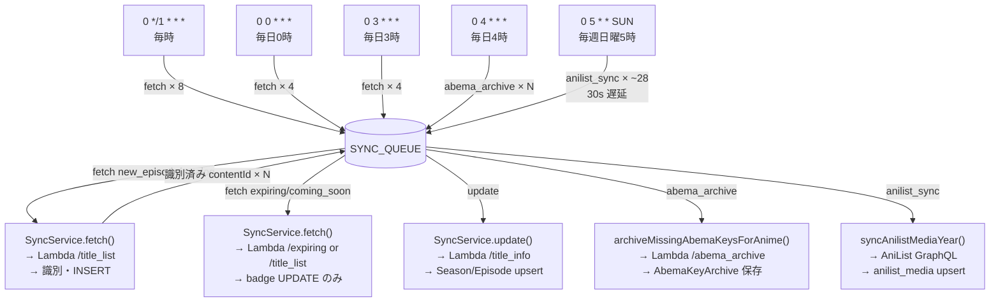

# Cron トリガー

`src/scheduled.ts` が処理する定期実行スケジュールの詳細。

時刻はすべて **UTC**。

## スケジュール一覧

| Cron | UTC 時刻 | JST 目安 | 処理 |
|---|---|---|---|
| `0 */1 * * *` | 毎時 0 分 | 毎時 9 分 | 新着・配信予定を全プロバイダで取得 |
| `0 0 * * *` | 毎日 00:00 | 毎日 09:00 | 配信終了間近タイトルを全プロバイダで取得 |
| `0 3 * * *` | 毎日 03:00 | 毎日 12:00 | 全カタログを全プロバイダで取得 |
| `0 4 * * *` | 毎日 04:00 | 毎日 13:00 | ABEMA HLS 鍵の未取得エピソードをアーカイブ |
| `0 5 * * SUN` | 毎週日曜 05:00 | 毎週日曜 14:00 | AniList メディア情報を全年度で同期 |

---

## `0 */1 * * *` — 毎時: 新着・配信予定

### 投入するキューメッセージ

```
fetch { provider: "hulu",        category: "new_episode"  }
fetch { provider: "hulu",        category: "coming_soon"  }
fetch { provider: "amazon",      category: "new_episode"  }
fetch { provider: "amazon",      category: "coming_soon"  }
fetch { provider: "crunchyroll", category: "new_episode"  }
fetch { provider: "crunchyroll", category: "coming_soon"  }
fetch { provider: "abema",       category: "new_episode"  }
fetch { provider: "abema",       category: "coming_soon"  }
```

合計 8 メッセージ。

### キューコンシューマの処理 (`queue.ts`)

**`new_episode`:**

```
SyncService.fetch()
    ├─ Lambda POST /title_list { provider, category: "new_episode" }
    │       └─ プロバイダから新着タイトル一覧を取得
    ├─ D1: anime + unidentifiedAnime テーブルで既知 contentId を除外
    ├─ 新規タイトル → anilist_media テーブルで識別 (20件バッチ)
    │       ├─ 識別成功 → anime INSERT (title, year, quarter, badge=NEW_EPISODE 等)
    │       └─ 識別失敗 → unidentifiedAnime upsert
    ├─ 既存タイトル → badge / nextEpisodeDate を UPDATE
    └─ 識別済み新規 + badge 付き既存 → update メッセージを再投入
           ↓
    SyncService.update() (per contentId)
           ├─ Lambda POST /title_info { provider, contentId }
           │       └─ シーズン・エピソード詳細を取得
           └─ D1: Anime upsert + Season/Episode 差分 INSERT
```

**`coming_soon`:**

```
SyncService.fetch()
    ├─ Lambda POST /title_list { provider, category: "coming_soon" }
    ├─ badge=COMING_SOON で anime/unidentifiedAnime を更新
    └─ update メッセージは投入しない（badge 更新のみ）
```

### badge 付与ルール

| プロバイダ | NEW_EPISODE 判定 | RECENTLY_ADDED 判定 |
|---|---|---|
| Crunchyroll | `item.new === true` | `item.new === false` |
| Hulu | assetInfo/palette の新着判定 | それ以外の更新済み |
| Amazon | badge メッセージなしを強制昇格 | API バッジをそのまま使用 |
| Abema | 一律 NEW_EPISODE | 使わない |

---

## `0 0 * * *` — 毎日 00:00: 配信終了間近

### 投入するキューメッセージ

```
fetch { provider: "hulu",        category: "expiring" }
fetch { provider: "amazon",      category: "expiring" }
fetch { provider: "crunchyroll", category: "expiring" }
fetch { provider: "abema",       category: "expiring" }
```

合計 4 メッセージ。

### キューコンシューマの処理

```
SyncService.fetch()
    ├─ Lambda POST /expiring { provider }
    │       └─ 配信終了間近タイトル一覧を取得 (remainingHours + season)
    ├─ 既存タイトル → badge=EXPIRING で UPDATE
    └─ update メッセージは投入しない（badge 更新のみ）
```

`expiring` はエピソード詳細の再取得は行わない。終了日情報（`expiredAt`）を anime レコードの badge フィールドに反映するだけ。

---

## `0 3 * * *` — 毎日 03:00: 全カタログ

### 投入するキューメッセージ

```
fetch { provider: "hulu",        category: "catalog" }
fetch { provider: "amazon",      category: "catalog" }
fetch { provider: "crunchyroll", category: "catalog" }
fetch { provider: "abema",       category: "catalog" }
```

合計 4 メッセージ。

### キューコンシューマの処理

`new_episode` と同じフロー（識別 → INSERT → update 再投入）。

```
SyncService.fetch()
    ├─ Lambda POST /title_list { provider, category: "catalog" }
    │       └─ 全カタログを取得（Amazon: 64 パス ~7,500 件 / Hulu: ~2,581 件）
    ├─ 新規タイトルを識別・INSERT
    └─ update メッセージを再投入 → SyncService.update() でエピソード同期
```

**Amazon の catalog は Lambda タイムアウトを 900 秒に引き上げ済み** (`infra/lambda.tf`)。約 10 分かかる。

---

## `0 4 * * *` — 毎日 04:00: ABEMA HLS 鍵アーカイブ

### 投入するキューメッセージ

`abemaKey` が null のエピソードを持つ ABEMA アニメ 1 件ごとに 1 メッセージ:

```
abema_archive { animeId: "..." }
abema_archive { animeId: "..." }
...
```

投入件数 = HLS 鍵未取得アニメの数。

### キューコンシューマの処理

```
archiveMissingAbemaKeysForAnime(animeId)
    ├─ DB: abemaKey が null のエピソードを検索
    ├─ Lambda: ABEMA の programId リストを渡してキー取得
    └─ DB: AbemaKeyArchive に保存 + Episode.abemaKey を更新
```

全エピソードのキーが揃っているアニメはスキップ（ログ: `abema-archive-skip`）。

---

## `0 5 * * SUN` — 毎週日曜 05:00: AniList 同期

### 投入するキューメッセージ

2000年から翌年分まで、1年ごとに **30 秒ずつ遅延** して投入:

```
anilist_sync { year: 2000, country: "JP" }  ← delay 0s
anilist_sync { year: 2001, country: "JP" }  ← delay 30s
anilist_sync { year: 2002, country: "JP" }  ← delay 60s
...
anilist_sync { year: 2027, country: "JP" }  ← delay N*30s
```

2026年時点で約 28 メッセージ（2000〜2027）。

### キューコンシューマの処理

```
syncAnilistMediaYear({ prisma, year, country: "JP" })
    ├─ AniList GraphQL API: その年に放送開始したアニメを全ページ取得
    └─ D1 anilist_media テーブル: upsert (aniListId, title, status, year, quarter 等)
```

30 秒遅延は AniList の rate limit 対策（バースト防止）。

### anilist_media テーブルの用途

`fetch` 処理で新規タイトルが出た際、Lambda の `/identify` エンドポイントは使わず、
この D1 テーブルをローカル検索して識別する（`identifyTitlesViaD1`）。
毎週日曜に最新化することで、その週に配信開始した新作タイトルを識別できる。

---

## エラー処理と通知

| ケース | 処理 | Discord 通知 |
|---|---|---|
| scheduled.ts 内の例外 | `scheduled-error` ログ | `Scheduled: キュー投入失敗` |
| キュー処理の失敗 | `message.retry()` でリトライ | 3 回失敗で `Queue: 最終リトライ失敗` |
| バッチ正常完了 | `message.ack()` | `Queue: バッチ完了` |

最大リトライ回数: **3 回**。3 回目に失敗すると Discord に通知してそのメッセージを破棄。

## フロー全体図


