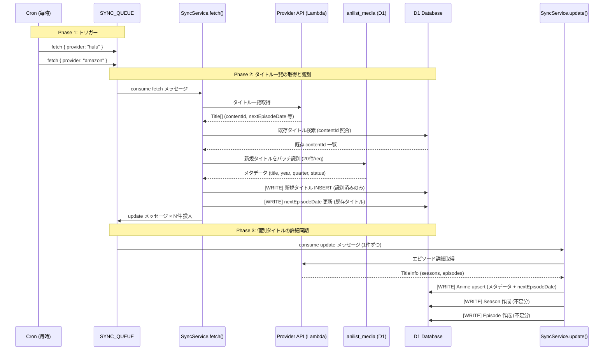

# Sync Queue アーキテクチャ

## 概要

Cloudflare Workers (Cron Trigger) → Queue → Lambda (日本IP) → D1 のパイプラインで、各プロバイダのタイトル・エピソード情報を定期取得する。

## Cron スケジュール

| Cron | 頻度 | 処理内容 |
|---|---|---|
| `0 */1 * * *` | 毎時 | `new_episode` + `coming_soon` を全プロバイダで fetch キューに投入 |
| `0 0 * * *` | 毎日 0時 | `expiring` を全プロバイダで fetch キューに投入 |
| `0 3 * * *` | 毎日 3時 | `catalog` を全プロバイダで fetch キューに投入 |
| `0 4 * * *` | 毎日 4時 | ABEMA HLS鍵未取得アニメを abema_archive キューに投入 |
| `0 5 * * SUN` | 毎週日曜 5時 | AniList メディア情報を年度ごとに anilist_sync キューに投入 (30秒ずつ遅延) |

対象プロバイダ: `hulu`, `amazon`, `crunchyroll`, `abema`

## メッセージタイプ

| type | 投入元 | 概要 |
|---|---|---|
| `fetch` | Cron (scheduled.ts) | Lambda でタイトル一覧取得 → D1で識別・絞り込み → update キューに投入 |
| `update` | fetch 処理後 / 手動 | Lambda でタイトル詳細取得 → D1 差分更新 |
| `bulk_update` | 手動 (admin API) | contentId リストをまとめて update キューに投入するだけ |
| `anilist_sync` | Cron (日曜5時) | AniList APIから年度別アニメ情報を取得して D1 の anilist_media テーブルを更新 |
| `abema_archive` | Cron (毎日4時) / 手動 | ABEMA HLS鍵未取得エピソードの暗号化キーを取得して D1 に保存 |

## 全体フロー

```
[Cron: 毎時]
    ↓
scheduled.ts
    ↓ Queue.send({ type: "fetch", provider, category: "new_episode" | "coming_soon" })
    ↓ (全プロバイダ × 全カテゴリ)

[Queue Consumer]
    ↓ fetch メッセージ受信
    ↓
SyncService.fetch()
    ├─ Lambda /title_list → プロバイダのタイトル一覧を全件取得
    ├─ D1: anime + unidentifiedAnime テーブルで既知 contentId を除外
    ├─ 新規タイトル → D1 の anilist_media テーブルで正規化タイトル検索して識別
    │       ├─ 識別成功 → anime テーブルに INSERT
    │       └─ 識別失敗 → unidentifiedAnime テーブルに upsert
    ├─ 既存タイトル → badge / nextEpisodeDate を更新
    └─ badge 付き既存タイトル + 新規識別済み → update キューに投入

    ↓ update メッセージ受信 (contentId 1件ずつ)
    ↓
SyncService.update()
    ├─ Lambda /title_info → タイトル詳細 (シーズン・エピソード) を取得
    └─ D1: シーズン・エピソードを差分 upsert

[バッチ完了後]
    └─ Discord Webhook → "Queue: バッチ完了" 通知 (成功N件)
       失敗が3回に達した場合 → Discord Webhook → "Queue: 最終リトライ失敗" 通知
```

## シーケンス図



## fetch フローの絞り込みロジック

```
Lambda から取得した全タイトル（例: Abema 71件）
    │
    ├─ [new_episode の場合] badge=COMING_SOON を除外
    │
    ├─ knownIds チェック (anime + unidentifiedAnime)
    │       └─ 既知 → スキップ（新規のみ残す）
    │
    ├─ 新規タイトル → D1 の anilist_media で識別（20件ずつバッチ）
    │       ├─ 識別成功 → anime INSERT → update キューに積む
    │       └─ 識別失敗 → unidentifiedAnime upsert（スキップ）
    │
    ├─ 既存タイトル → badge / nextEpisodeDate 更新
    │
    └─ badge 付き既存タイトル → update キューに積む
       （badge なし = 変化なし = スキップ）
```

## DB への書き込みタイミング

| Phase | タイミング | 対象テーブル | 操作 |
|---|---|---|---|
| fetch | AniList 識別成功時 | `anime` | 新規タイトルを INSERT (browse 情報 + メタデータ) |
| fetch | nextEpisodeDate を持つ既存タイトルに対して | `anime` | `nextEpisodeDate` を UPDATE |
| update | メタデータ取得後 | `anime` | upsert (title, status, year, quarter, nextEpisodeDate 等) |
| update | シーズン差分比較後 | `seasons` | 不足分を INSERT |
| update | エピソード差分比較後 | `episodes` | 不足分を INSERT |

## badge の種類と付与ルール

| badge | 意味 | カテゴリ |
|---|---|---|
| `NEW_EPISODE` | 新着エピソードあり | new_episode |
| `RECENTLY_ADDED` | 最近追加 | new_episode |
| `COMING_SOON` | 近日配信予定 | coming_soon |
| `EXPIRING` | 配信終了間近 | expiring |

プロバイダ別の付与判定:

| プロバイダ | NEW_EPISODE | RECENTLY_ADDED |
|---|---|---|
| Crunchyroll | `item.new === true` | `item.new === false` |
| Hulu | badge_text が新着系 | それ以外の更新済み |
| Amazon | badge未設定を強制昇格 | APIのバッジそのまま |
| Abema | 一律 NEW_EPISODE に固定 | 使わない |

## SyncService 関数一覧

| 関数 | 役割 | 呼び出し元 |
|---|---|---|
| `checkNewEpisodes` | プロバイダの新着チェック→識別→DB追加/更新 | scheduled.ts |
| `syncTitle` | TitleDetail を DB に upsert | checkNewEpisodes, API routes |
| `syncEpisodesFromTmdb` | TMDB からエピソード情報を取得・補完 | scheduled.ts |
| `syncEpisodeIds` | プロバイダの episodeId を DB に反映 | API routes |
| `fetchDetail` | プロバイダからタイトル詳細を取得 | syncEpisodeIds |
| `getProvider` | プロバイダ名からインスタンスを取得 | 各関数 |

### syncTitle の upsert 挙動

| テーブル | upsert キー | create 時のみ | create / update 両方 |
|---|---|---|---|
| Anime | `[provider, contentId]` | title, provider, contentId, year, quarter | description, entityType, maturityRating, benefitId |
| Season | `[animeId, seasonId]` | animeId, seasonId | displayName, seasonNumber, imageUrl |
| Episode | `[seasonId, episodeNumber]` | seasonId, episodeNumber | episodeId, title, description, releaseDate, duration, maturityRating, imageUrl, hasSubtitles, hasDub, benefitId |

**`recorded` フラグはユーザー操作でのみ更新（sync では変更しない）。**

### syncEpisodesFromTmdb の update 条件

TMDB からの update は **非空フィールドのみ** 上書きする（プロバイダ側の episodeId 等を消さないため）:

```
if (ep.title)       → update title
if (ep.description) → update description
if (ep.releaseDate) → update releaseDate
if (ep.duration)    → update duration
```

### syncEpisodeIds のシーズン数マッチング

| 条件 | 方式 |
|---|---|
| プロバイダ側と DB 側のシーズン数が一致 | `seasonNumber` で直接マッチ |
| シーズン数が不一致 | プロバイダの全エピソードをフラットに展開し、DB 側シーズンの話数に合わせて累積オフセットで振り分け |

例: プロバイダが 1 シーズン 24 話、DB（TMDB由来）が 2 シーズン各 12 話の場合 → プロバイダ 1〜12 話 → DBシーズン1、13〜24 話 → DBシーズン2 にマッピング。

## メッセージ形式

### fetch

```json
{
  "type": "fetch",
  "message": { "provider": "hulu" }
}
```

### update

```json
{
  "type": "update",
  "message": { "provider": "hulu", "contentId": "dandadan" }
}
```

## Lambda エンドポイント

Worker → Lambda の通信は AWS SigV4 署名 (Lambda Function URL)。

| パス | 処理 |
|---|---|
| `POST /title_list` | プロバイダのタイトル一覧取得 (`new_episode` / `coming_soon` / `catalog`) |
| `POST /expiring` | 配信終了間近タイトル一覧取得 |
| `POST /title_info` | タイトル詳細 + シーズン・エピソード取得 |
| `POST /identify` | AniList API でタイトル識別（現在未使用: D1 ローカル検索に移行済み） |

## AniList 識別

現在は Lambda `/identify` (AniList API 直接呼び出し) は使用しておらず、事前に `anilist_sync` cron で同期済みの D1 `anilist_media` テーブルをローカル検索する (`identifyTitlesViaD1`)。

毎週日曜 5時の `anilist_sync` cron が年度ごとに AniList API を叩いて `anilist_media` を更新する（2000年〜翌年分、1年あたり30秒遅延でレートリミット対策）。

## キュー設定

| 項目 | 値 |
|---|---|
| キュー名 | `anime-tracker-sync-{staging\|production}` |
| バインディング | `SYNC_QUEUE` |
| 最大バッチサイズ | 5 件 |
| 最大並行数 | 2 Worker |
| 最大リトライ回数 | 3 回 |

並行数とバッチサイズを絞っているのはプロバイダのスクレイピング先をレートリミットしないため。

## 手動実行

`POST /api/queues` でキューを経由せず SyncService を直接実行できる（管理画面から操作）。
