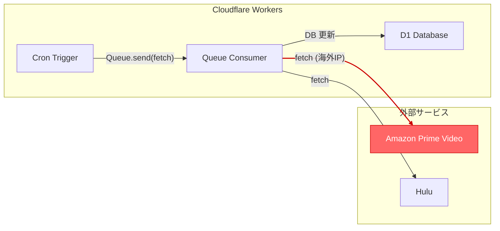
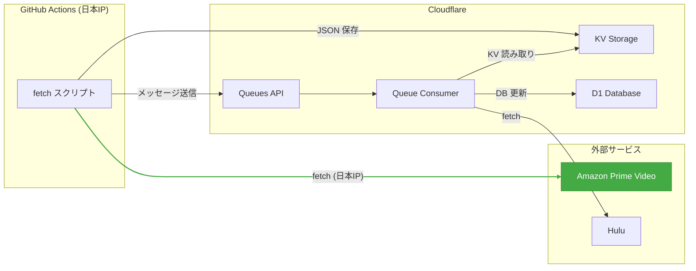

# Amazon データ取得の GitHub Actions 移行

## 背景・移行理由

Cloudflare Workers の Queue consumer はリージョン指定ができない。
Workers からAmazon Prime Video のブラウズページを取得すると、**海外IPと判定**されてレスポンスが日本向けと異なる:

- `highValueMessage` に配信終了メッセージ（「Primeでの配信は5日以内に終了」）が返らず、ランキング情報（「アクションのTV番組で第9位」）に差し替わる
- `expiredAt` を計算できないため、配信終了間近タイトルの更新が全件スキップされる

Smart Placement / Placement Hint はいずれも HTTP トリガーのみ対応で、Queue / Cron トリガーには適用されない。

この問題は expiring に限らず、新着アニメ (`new_episode`) や全件取得 (`all`) でも発生する可能性がある。

## 現行アーキテクチャ



- **毎時**: `new_episode` カテゴリで Amazon / Hulu のブラウズページを取得
- **毎日 00:00 UTC**: `expiring` カテゴリで配信終了間近タイトルを取得
- 全て Workers 上で完結
- Amazon への fetch が**海外 IP** となり、日本向けレスポンスが返らない

## 提案アーキテクチャ



### KV データ形式

```json
{
  "fetchedAt": "2026-03-27T12:00:00.000Z",
  "entries": [
    {
      "contentId": "B0DBZJZ8FF",
      "expiredAt": "2026-04-01T15:00:00.000Z",
      "expiringSeason": 1
    }
  ]
}
```

`expiredAt` はスクリプト側で計算済み（JST 00:00 に丸め）。Worker 側は計算不要。

### Queue 発火方法

Cloudflare Queues HTTP API でメッセージを直接送信:

```
POST /accounts/{account_id}/queues/{queue_id}/messages
```

または `wrangler` に send コマンドがないため、`curl` で API を叩く。

## 移行スコープ

### Phase 1: expiring のみ（現在実装中）

| 項目 | 内容 |
|------|------|
| GitHub Actions ワークフロー | `fetch_expiring.yaml` — cron `0 15 * * *` (JST 00:00) + workflow_dispatch |
| スクリプト | `scripts/fetch-expiring.ts` — fetch → expiredAt 計算 → KV 保存 |
| Worker 変更 | `fetchExpiring()` — KV からデータ読み取り、直接 DB 更新 |
| 実装コスト | 小（スクリプト + ワークフロー + sync.ts 修正のみ） |

### Phase 2: new_episode / all

| 項目 | 内容 |
|------|------|
| GitHub Actions ワークフロー | 既存の `fetch_expiring.yaml` を拡張または別ワークフロー |
| スクリプト | `scripts/fetch-browse.ts` — 全モード対応 |
| Worker 変更 | `fetchNewEpisode()` も KV 経由に変更 |
| 実装コスト | 中（ページネーション含む全件取得、AniList 連携の移行判断が必要） |

### Phase 3: Cron トリガーの廃止

Workers 側の Cron (`scheduled.ts`) を廃止し、全て GitHub Actions から Queue を発火する構成に統一。

## コスト

### GitHub Actions

- **実行時間**: 約 10-15 秒/回（fetch + KV PUT + Queue send）
- **月間実行回数**: expiring 1回/日 = 30回、new_episode 24回/日 = 720回
- **月間コスト**: 約 750 回 × 15 秒 ≈ 3 時間（無料枠 2,000 分/月の範囲内）

### Cloudflare KV (Paid プラン)

- **書き込み**: 1回/実行 — 月 750 回（上限なし）
- **読み取り**: Worker 側で 1回/実行 — 月 750 回（上限なし）
- Paid プランのため余裕あり

### 追加の外部依存

- GitHub Actions の可用性に依存（ただし workflow_dispatch で手動実行も可能）

## 必要な Secrets

| Secret | 用途 |
|--------|------|
| `CLOUDFLARE_API_TOKEN` | KV 書き込み + Queue メッセージ送信（既存） |
| `CLOUDFLARE_ACCOUNT_ID` | Cloudflare API（既存） |
| `KV_NAMESPACE_ID` | KV namespace 指定（新規） |
| `QUEUE_ID` | Queue メッセージ送信用（新規、Phase 3 で必要） |
