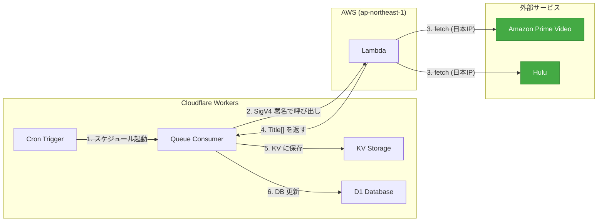

# データ取得の AWS Lambda 移行

## 背景

Cloudflare Workers の Queue/Cron consumer はリージョン指定不可（Smart Placement 対象外）。
Amazon Prime Video は日本国外 IP からのアクセスで 503 または日本向けデータが欠落する:

- `highValueMessage`（配信終了メッセージ）がランキング情報に差し替わる
- 一部ブラウズページで 503 が返る

Hulu も今後同様の問題が発生する可能性があるため、**全プロバイダのブラウズ取得を日本リージョンの Lambda に統一**する。

## 提案アーキテクチャ



### ポイント

- **スケジュールは Workers Cron に集約**（EventBridge 不要）
- **Lambda は fetch プロキシ**（引数を受けて `Title[]` を返すだけ、KV/DB を触らない）
- **Workers が KV 書き込み・DB 更新を一貫して管理**（タイミング問題なし）
- **Function URL は AWS_IAM 認証**（不正リクエストは Lambda 到達前にブロック、課金ゼロ）
- **Workers → Lambda は `aws4fetch` で SigV4 署名**

### データフロー

1. Workers Cron → Queue にメッセージ送信
2. Queue Consumer → Lambda Function URL を SigV4 署名で呼び出し
3. Lambda → プロバイダの fetch → `Title[]` をレスポンスとして返す
4. Queue Consumer → `Title[]` を KV に保存 → DB 更新

### KV キー設計

| キー | 用途 |
|------|------|
| `browse:amazon:expiring` | Amazon 配信終了タイトル |
| `browse:amazon:new_episode` | Amazon 新着タイトル (Phase 2) |
| `browse:hulu:expiring` | Hulu 配信終了タイトル (Phase 2) |
| `browse:hulu:new_episode` | Hulu 新着タイトル (Phase 2) |

### KV データ形式

```json
{
  "fetchedAt": "2026-03-27T15:00:00.000Z",
  "entries": [
    {
      "contentId": "B0DBZJZ8FF",
      "expiredAt": "2026-04-01T00:00:00+09:00",
      "expiringSeason": 1
    }
  ]
}
```

Lambda 側で `remainingHours` → `expiredAt`（JST 00:00 丸め）に変換済み。Workers 側は計算不要。

## Lambda 設計

### 単一関数・イベントルーティング

```typescript
interface FetchEvent {
  provider: 'amazon' | 'hulu'
  category: 'expiring' | 'new_episode'
}

// レスポンス: Title[]
```

- Cloudflare の認証情報は不要（fetch して加工して返すだけ）
- `remainingHours` → `expiredAt`（JST 00:00 丸め）の変換は Lambda 側で実施
- 環境変数なし（将来的にプロバイダ設定が必要になれば追加）

### 呼び出し方法

| 方法 | 用途 | 認証 |
|------|------|------|
| Workers → Function URL | 本番の定期実行 | SigV4 (`aws4fetch`) |
| `aws lambda invoke` CLI | 手動実行・デバッグ | AWS CLI 認証 |

## インフラ (Terraform)

### リソース一覧

| リソース | 名前 | 用途 |
|----------|------|------|
| IAM Role | `anime-tracker-lambda` | Lambda 実行（ログ権限のみ） |
| Lambda Function | `anime-tracker-fetch` | fetch プロキシ |
| Function URL | — | Workers からの呼び出し（AWS_IAM 認証） |

EventBridge Scheduler は不要（Workers Cron に集約）。

### Workers 側の追加設定

| 項目 | 内容 |
|------|------|
| `aws4fetch` | `bun add aws4fetch` |
| Workers 環境変数 | `AWS_ACCESS_KEY_ID`, `AWS_SECRET_ACCESS_KEY`, `LAMBDA_FUNCTION_URL` |

### Terraform state

Cloudflare R2 (S3 互換):

- バケット: `terraform-state`
- キー: `anime-tracker/terraform.tfstate`

## フェーズ

### Phase 1: Amazon expiring

最小構成。Lambda で Amazon 配信終了タイトルを fetch → Workers が KV 保存 → DB 更新。

| 項目 | 内容 |
|------|------|
| Lambda ハンドラ | `lambda/fetch-expiring/index.ts` — `AmazonProvider.fetchTitleList({ expiringOnly: true })` |
| Terraform | `infra/*.tf` — Lambda + IAM + Function URL |
| Workers 変更 | Queue Consumer で Lambda 呼び出し → KV 保存の統合 |
| 依存追加 | `aws4fetch` |
| ビルド | `bun build --target=node` → zip |
| クリーンアップ | `fetch_expiring.yaml` 削除、`scripts/fetch-expiring.ts` 削除 |

### Phase 2: 全プロバイダ×カテゴリ対応

| 項目 | 内容 |
|------|------|
| Lambda ハンドラ | イベントルーティング追加（provider × category） |
| Hulu expiring | `HuluProvider.fetchTitleList({ expiringOnly: true })` 実装 |
| Workers 変更 | `fetchNewEpisode()` も Lambda + KV 経由に変更 |

### Phase 3: Workers Cron 整理

Workers の Queue Consumer から外部 fetch を完全に除去。全ての fetch は Lambda 経由に統一。

## コスト見積もり

| リソース | 月間利用 | コスト |
|----------|----------|--------|
| Lambda | 30〜750 回/月 × ~15 秒 × 256MB | 無料枠内 |
| Function URL | Workers からの呼び出しのみ | 無料 |
| CloudWatch Logs | ~1KB/回 | 無料枠内 |
| R2 (state) | ~1 ファイル | 無料枠内 |

不正リクエストは AWS_IAM 認証により Lambda 到達前にブロック → 課金ゼロ。

## ディレクトリ構成（完成時）

```
infra/
  main.tf              # provider, backend (R2)
  variables.tf         # 変数定義
  lambda.tf            # Lambda + IAM + Function URL
lambda/
  fetch-expiring/
    index.ts           # ハンドラ（fetch → Title[] を返すだけ）
    build.ts           # bun build スクリプト
    dist/              # ビルド成果物 (git 管理外)
```

## 必要な Secrets / 環境変数

### AWS (Terraform / デプロイ)

| 名前 | 保存先 |
|------|--------|
| `AWS_ACCESS_KEY_ID` | `~/.aws/credentials` |
| `AWS_SECRET_ACCESS_KEY` | `~/.aws/credentials` |
| `R2_ACCESS_KEY_ID` | `.env` |
| `R2_SECRET_ACCESS_KEY` | `.env` |

### Cloudflare Workers 環境変数

| 名前 | 用途 |
|------|------|
| `AWS_ACCESS_KEY_ID` | Lambda Function URL の SigV4 署名 |
| `AWS_SECRET_ACCESS_KEY` | Lambda Function URL の SigV4 署名 |
| `LAMBDA_FUNCTION_URL` | Lambda Function URL のエンドポイント |
