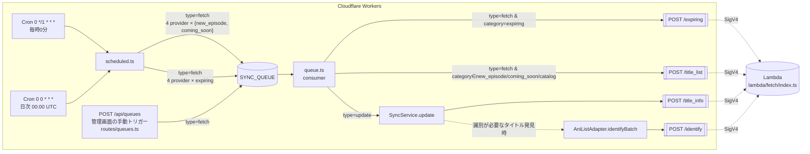
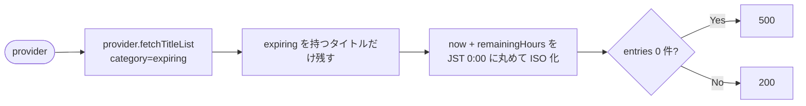
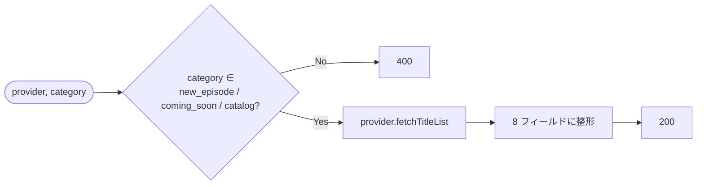
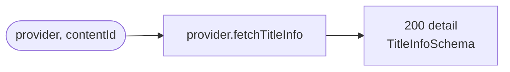
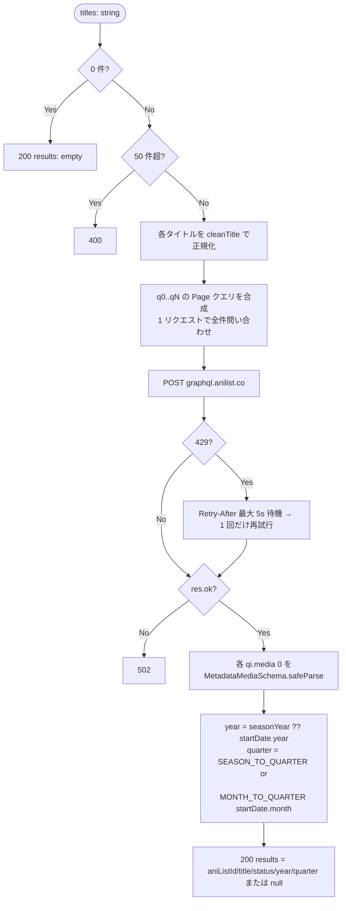

# Lambda fetch ハンドラ 処理フロー

`lambda/fetch/index.ts` (307 行 / 全機能を 1 ファイルに集約) の役割と呼び出し経路をまとめる。

- 役割: 日本 IP が必要な Provider 取得と AniList 照合を Workers の代わりに実行
- リージョン: `ap-northeast-1` (JP) / Crunchyroll のみ US Lambda
- 副作用なし: KV/D1 は触らない。fetch → 整形 → JSON 返却のみ
- 認証: Lambda Function URL に対して Workers 側の `src/lib/lambda.ts` が SigV4 署名で POST

## 1. エントリーポイント一覧

`event.rawPath` / `event.path` で振り分ける 4 エンドポイント。

| Path | 用途 | リクエスト body | レスポンス body |
| --- | --- | --- | --- |
| `POST /expiring` | 配信終了間近タイトル一覧 | `{ provider }` | `{ fetchedAt, entries: [{ contentId, expiredAt, expiringSeason }] }` |
| `POST /title_list` | 新着 / 配信予定 / カタログ一覧 | `{ provider, category }` | `{ fetchedAt, entries: [{ contentId, title, description, entityType, imageUrl, maturityRating, nextEpisodeDate, badge }] }` |
| `POST /title_info` | タイトル詳細（シーズン + エピソード） | `{ provider, contentId }` | `TitleInfoSchema` (seasons[] とその episodes[]) |
| `POST /identify` | AniList へのバッチ照合（≤ 50 件） | `{ titles: string[] }` | `{ results: ({ aniListId, title, status, year, quarter } \| null)[] }` |

エラー時は `400` (バリデーション) / `404` (未知 path) / `500` (例外) / `502` (AniList 失敗) を返す。

## 2. トリガーと呼び出し経路

要点:

- **Lambda は自分から動かない。** すべて Workers の Cron / Queue consumer / 管理画面 API がトリガー
- `POST /title_list` → 結果の `contentIds` を受け取った queue.ts が、新着系については **個別に `type=update` を再 enqueue** し、後段で `/title_info` を叩く 2 段構え
- `POST /identify` は `SyncService` が AniList 照合が必要なタイトルをまとめて投げる経路（Workers から直接 AniList を叩くのを避ける目的）
- `0 4 * * *` の Cron は `abema_archive` 専用で Lambda は呼ばない

### 呼び出し元の対応表

| Lambda endpoint | 直接呼ぶ Workers 関数 | 元のトリガー |
| --- | --- | --- |
| `/expiring` | `lambda.fetchExpiring()` in `queue.ts:43` / `routes/queues.ts:99` | Cron `0 0 * * *` |
| `/title_list` | `lambda.fetchTitleList()` in `queue.ts:44` / `routes/queues.ts:100` | Cron `0 */1 * * *` |
| `/title_info` | `lambda.fetchTitleInfo()` in `lib/sync.ts:79` | Queue `type=update`（前段で `/title_list` 結果から enqueue） |
| `/identify` | `lambda.identifyTitles()` in `lib/metadata/anilist.ts:261` | `SyncService` 内のメタデータ照合 |

## 3. 各エンドポイントの内部処理

### 3.1 `/expiring`

### 3.2 `/title_list`

### 3.3 `/title_info`

### 3.4 `/identify` (AniList バッチ照合)

定数:

- `SEASON_TO_QUARTER`: `WINTER=0` / `SPRING=1` / `SUMMER=2` / `FALL=3`
- `MONTH_TO_QUARTER`: 1–3月=0, 4–6月=1, 7–9月=2, 10–12月=3

## 4. 補足

### Provider の振り分け

`getProvider(name)` で `hulu` / `crunchyroll` / `abema` / `amazon` を分岐（既定は Amazon）。Provider 実装本体は **Workers と共有**:

- `src/lib/providers/{abema,amazon,crunchyroll,hulu}`
- `src/schemas/providers/*`
- `src/lib/metadata/anilist` (`cleanTitle`)
- `src/lib/logger`

つまり Lambda は薄いラッパーで、Provider のスクレイピング/API ロジックは Workers と同じコードを走らせている。

### US / JP の Function URL

Workers 側 `src/lib/lambda.ts:24` の `getBaseUrl()` が決める:

| provider | 呼ぶ Lambda |
| --- | --- |
| `crunchyroll` | `LAMBDA_FUNCTION_URL_US`（あれば） |
| その他 | `LAMBDA_FUNCTION_URL` (JP) |

### レスポンス検証

Workers 側は受け取った JSON を Zod でパースしてから返す:

- `/expiring` → `ExpiringResponseSchema`
- `/title_list` → `TitleListResponseSchema`
- `/title_info` → `TitleInfoSchema`
- `/identify` → `IdentifyResponseSchema`

`lambda/fetch/index.ts` 内部でも `MetadataMediaSchema.safeParse` で AniList レスポンスを検証している。
