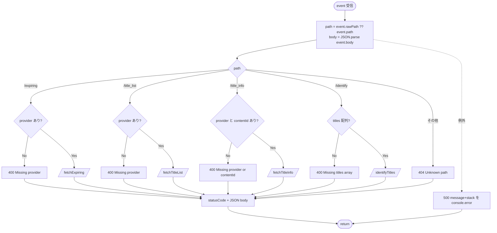
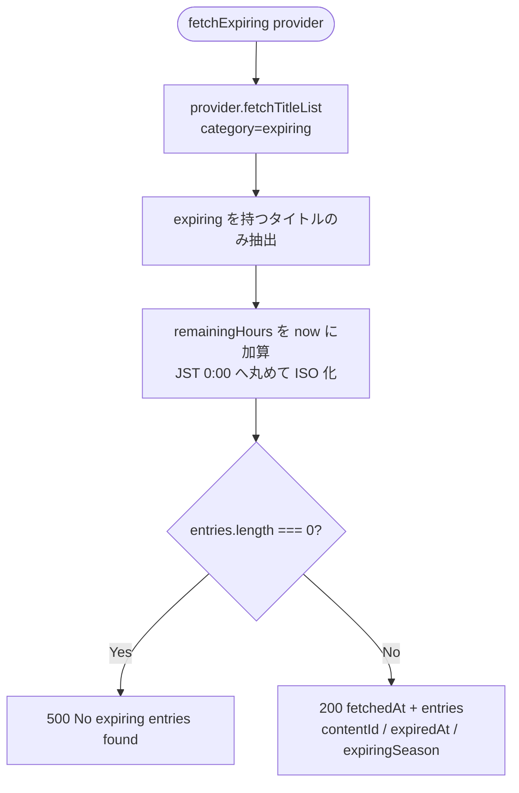
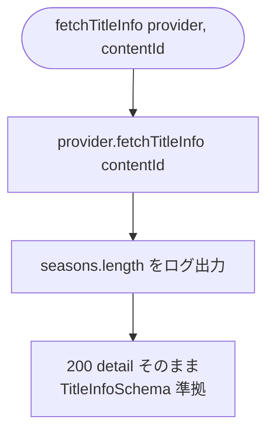
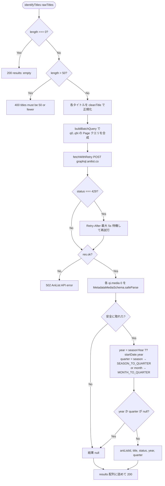
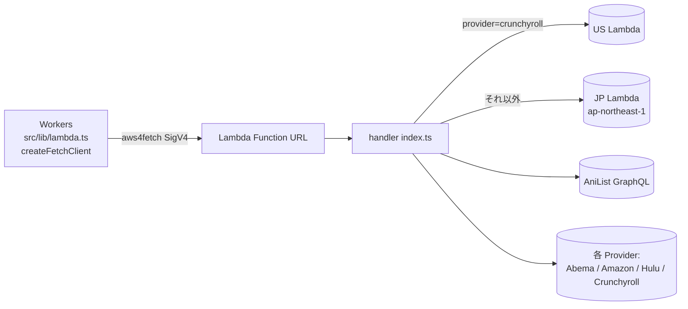

# Lambda fetch ハンドラ 処理フロー

`lambda/fetch/index.ts` の処理を Mermaid でまとめたもの。

- 役割: 日本 IP (ap-northeast-1) が必要な Provider 取得と AniList 照合の代行
- 副作用: KV / DB は触らない（fetch → 整形 → JSON 返却のみ）
- 呼び出し元: Workers 側の `src/lib/lambda.ts` (`createFetchClient`) が SigV4 署名付き POST で叩く
- Provider 振り分け: 既定は JP Lambda、`crunchyroll` のみ US Lambda

## 1. エントリーポイント (handler)



`getProvider(name)` は `hulu | crunchyroll | abema | amazon` のいずれかを返す（既定は Amazon）。

## 2. POST /expiring  (配信終了間近)



## 3. POST /title_list  (new_episode / coming_soon / catalog)

```mermaid
flowchart TD
  S([fetchTitleList provider, category]) --> V{category は<br/>new_episode | coming_soon | catalog?}
  V -->|No| Err[400 Invalid category]
  V -->|Yes| Fetch[provider.fetchTitleList category]
  Fetch --> Map[各タイトルを整形<br/>contentId, title, description,<br/>entityType, imageUrl,<br/>maturityRating, nextEpisodeDate, badge]
  Map --> Ok[200 fetchedAt + entries]
```

## 4. POST /title_info  (タイトル詳細)



## 5. POST /identify  (AniList 照合)



補足:

- `MEDIA_FIELDS` は `id / title.native / countryOfOrigin / status / season / seasonYear / startDate{year,month,day}` を取得
- `SEASON_TO_QUARTER`: WINTER=0 / SPRING=1 / SUMMER=2 / FALL=3
- `MONTH_TO_QUARTER`: 1-3月=0, 4-6月=1, 7-9月=2, 10-12月=3
- `fetchWithRetry` は 429 のときだけ 1 回だけ再試行（Retry-After は 5 秒で頭打ち）

## 6. 上流から見た呼び出し関係



呼び出し側のクライアントは `src/lib/lambda.ts:61` を参照。レスポンスは `src/schemas/lambda.dto.ts` の各 Schema (`ExpiringResponseSchema` / `TitleListResponseSchema` / `TitleInfoSchema` / `IdentifyResponseSchema`) で `safeParse` 検証している。
