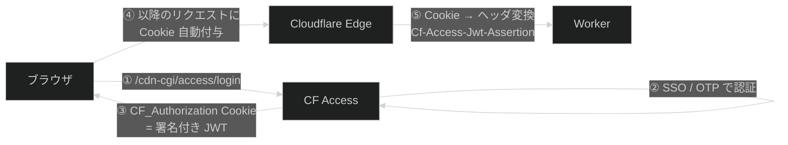
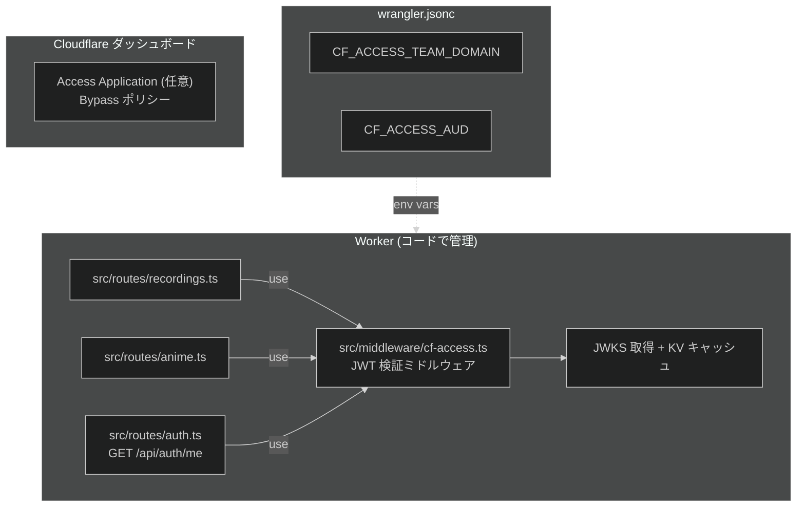
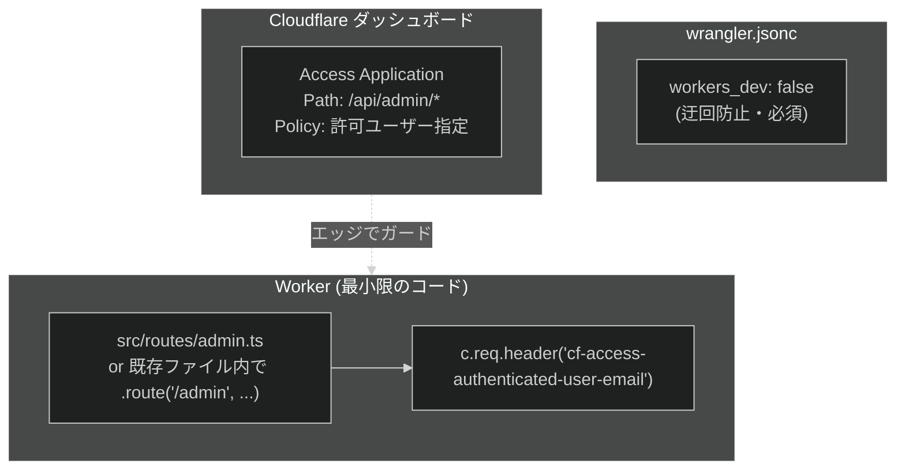
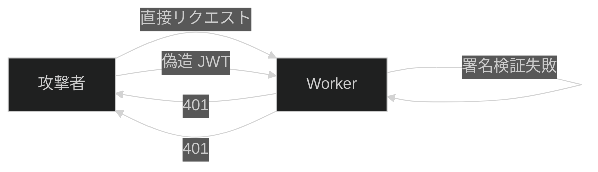
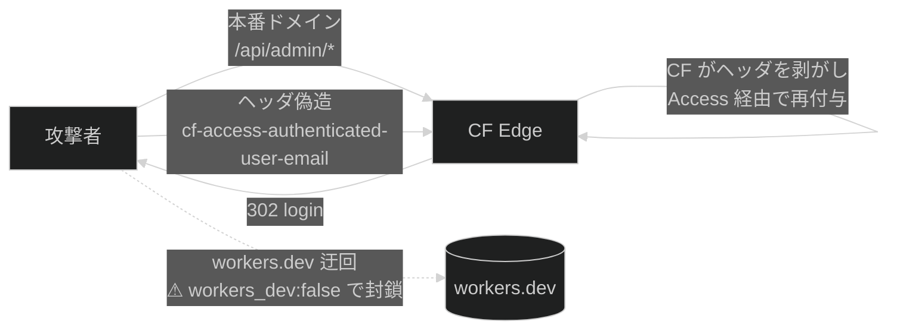
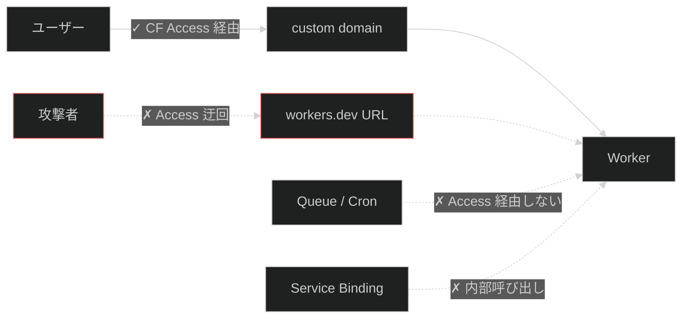
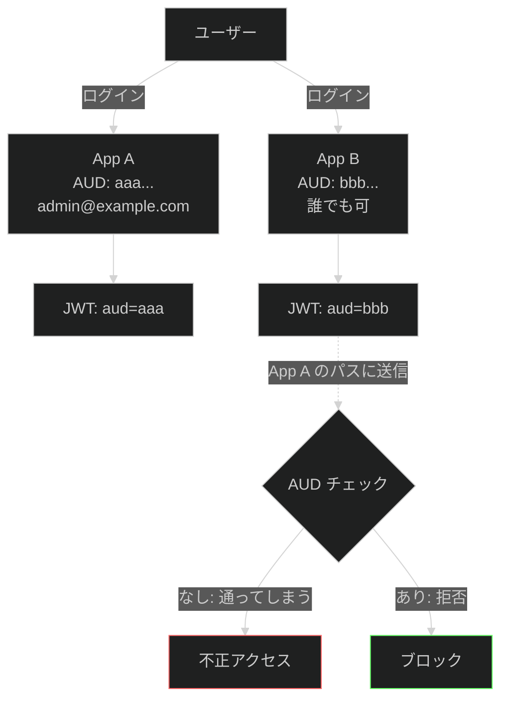
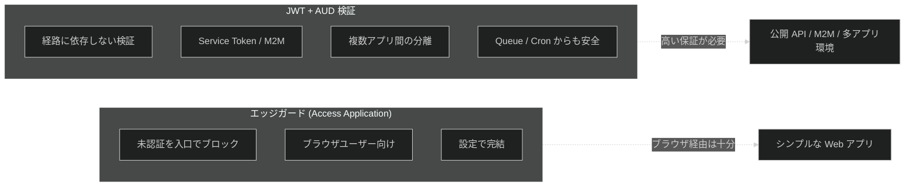

```mermaid
%%{init: {'theme':'dark'}}%%
sequenceDiagram
    autonumber
    participant U as ブラウザ
    participant CF as Cloudflare Edge
    participant A as CF Access
    participant W as Worker (Hono)
    participant K as KV (JWKS cache)

    rect rgb(60, 30, 30)
    Note over U,W: 未認証リクエスト
    U->>CF: PUT /api/recordings
    CF->>W: そのまま転送 (ヘッダ無し)
    W->>W: cfAccessMiddleware 実行
    W-->>U: 401 Unauthorized
    U->>U: /cdn-cgi/access/login に遷移
    end

    rect rgb(30, 50, 30)
    Note over U,A: Access でログイン
    U->>A: 認証 (SSO / OTP 等)
    A-->>U: CF_Authorization Cookie 発行 (JWT)
    end

    rect rgb(30, 40, 60)
    Note over U,W: 認証後リクエスト
    U->>CF: PUT /api/recordings<br/>Cookie: CF_Authorization=JWT
    CF->>CF: Cookie → Cf-Access-Jwt-Assertion<br/>ヘッダに変換
    CF->>W: PUT /api/recordings<br/>+ Cf-Access-Jwt-Assertion
    W->>K: JWKS 取得 (キャッシュ)
    K-->>W: 公開鍵
    W->>W: JWT 署名検証 + aud チェック
    W->>W: email 抽出
    W-->>U: 200 OK
    end
```

```mermaid
%%{init: {'theme':'dark'}}%%
sequenceDiagram
    autonumber
    participant U as ブラウザ
    participant CF as Cloudflare Edge
    participant A as CF Access
    participant W as Worker (Hono)

    rect rgb(60, 30, 30)
    Note over U,W: 未認証リクエスト
    U->>CF: PUT /api/admin/recordings
    CF->>A: パスが /api/admin/* に一致
    A->>A: Cookie 無し → 拒否
    A-->>U: 302 → Access ログインページ
    Note over W: Worker には到達しない
    end

    rect rgb(30, 50, 30)
    Note over U,A: Access でログイン
    U->>A: 認証 (SSO / OTP 等)
    A-->>U: CF_Authorization Cookie 発行
    end

    rect rgb(30, 40, 60)
    Note over U,W: 認証後リクエスト
    U->>CF: PUT /api/admin/recordings<br/>Cookie: CF_Authorization=JWT
    CF->>A: /api/admin/* 一致 → 検証
    A->>A: JWT 検証 OK
    A->>W: PUT /api/admin/recordings<br/>+ cf-access-authenticated-user-email<br/>+ Cf-Access-Jwt-Assertion
    W->>W: ヘッダから email を読むだけ<br/>(検証不要)
    W-->>U: 200 OK
    end

    rect rgb(55, 50, 20)
    Note over U,W: 閲覧 (公開) リクエスト
    U->>CF: GET /api/recordings
    CF->>W: /admin/* ではない → そのまま転送
    W-->>U: 200 OK (全員閲覧可)
    end
```

# Cloudflare Access 認証の 2 方式比較

Date: 2026-04-10

録画ミューテーション API を Cloudflare Access で保護する際、**「どこで認証判定するか」** によって 2 つの方式がある。本ドキュメントはその違いを整理する。

---

## TL;DR

| 観点 | 方式 A: アプリ側 JWT 検証 | 方式 B: CF Access パスガード |
| --- | --- | --- |
| 認証判定の場所 | Worker 内のミドルウェア | Cloudflare エッジ (Access) |
| Worker が認証コードを持つか | **持つ** (JWKS 取得 / JWT 検証 / KV キャッシュ) | **持たない** (ヘッダを信頼するだけ) |
| 未認証リクエストが Worker に到達するか | **到達する** (401 を返す) | **到達しない** (Access がブロック) |
| API パス変更 | 不要 | 必要 (`/api/admin/*` に移動) |
| workers.dev 無効化 | 任意 | **必須** (迂回防止) |
| 新規コード量 | 多い (middleware + JWKS + DTO) | 少ない (ヘッダ参照のみ) |
| 設定変更の発生場所 | コード | Cloudflare ダッシュボード |
| 既存 `/admin/*` 運用との整合 | 別ルール | **同じルールで統一** |

**結論**: このプロジェクトでは **方式 B (パスガード)** を推奨。

> **重要**: 方式 A でも **Access Application の作成は必須** (AUD タグを取得するため)。Application が存在し Allow ポリシーが設定された時点で、Cloudflare はエッジで未認証リクエストをブロックする。つまり方式 A の JWT 検証は **エッジガードの defense-in-depth** にすぎず、ブラウザ経由の通常リクエストにおいては実質的に冗長。詳細は [§ JWT / AUD 検証は何のためにあるか](#jwt--aud-検証は何のためにあるか) を参照。

---

## 共通の前提: Cloudflare Access の仕組み

どちらの方式でも Cloudflare Access が発行する **JWT (CF_Authorization Cookie)** が認証の根拠となる。

- JWT には `email`, `aud` (Application Audience tag), `exp` などが入る
- 署名鍵は `https://<team>.cloudflareaccess.com/cdn-cgi/access/certs` で公開される (JWKS)
- `aud` はアプリケーションごとにユニークな 64 文字の 16 進文字列

---

## 方式 A: アプリ側 JWT 検証 (`CF_ACCESS_TEAM_DOMAIN` 使用)

Cloudflare Access は **JWT を発行するだけ**。実際のアクセス可否判定は Worker 内のミドルウェアで JWT を検証して行う。CF Access のアプリケーション設定では **ガードしない** (Bypass ポリシーまたはアプリケーション未定義)。

### リクエストフロー

### 必要な実装

### Pros
- **API パスを変えなくてよい** (既存の `/api/recordings`, `/api/anime/:id` のまま)
- workers.dev 経由でもミドルウェアが動くので迂回されない
- 細かい制御が可能 (特定のメソッドだけ保護など)

### Cons
- JWKS 取得・JWT 署名検証 (Web Crypto)・KV キャッシュのコードが必要
- `CF_ACCESS_TEAM_DOMAIN` / `CF_ACCESS_AUD` を env ごとに管理
- JWKS ローテーション時のキャッシュ整合性に注意
- ローカル dev で JWT が無いため bypass 分岐が必要
- 認証ロジックがコードに散らばる → 変更時はデプロイが必要

---

## 方式 B: CF Access パスガード (`/api/admin/*`)

Cloudflare Access のアプリケーションで `/api/admin/*` というパスを保護する。**未認証リクエストは Worker に到達しない**。Worker は CF Access が付与した `cf-access-authenticated-user-email` ヘッダを信頼して読むだけ。

### リクエストフロー

### 必要な実装

### API パスの変更

| 変更前 (公開想定) | 変更後 (保護) |
| --- | --- |
| `PUT /api/recordings/` | `PUT /api/admin/recordings/` |
| `PUT /api/recordings/bulk` | `PUT /api/admin/recordings/bulk` |
| `PATCH /api/anime/:id` | `PATCH /api/admin/anime/:id` |
| `POST /api/anime/:id/record` | `POST /api/admin/anime/:id/record` |
| — | `GET /api/admin/me` (新設) |

`GET /api/recordings`, `GET /api/anime`, `GET /api/anime/:id` などの閲覧系は現状維持。

### Pros
- **Worker に認証コードが一切不要** (JWKS / JWT 検証 / KV キャッシュ 全て不要)
- 認証ポリシーの変更が **ダッシュボードで完結** (デプロイ不要)
- 既存の `/admin/*` ガード運用と **同じルール** で統一できる
- 保護漏れが起きにくい (パスプレフィックスで機械的に判定)

### Cons
- API パス変更が必要 (schemas, zodios client, backend route 全て)
- **`workers_dev: false` を必須設定**にする必要あり (workers.dev URL は Access を経由しないため迂回される)
- フロントエンドで `/api/admin/me` が HTML (ログインページ) を返した場合を「未認証」として扱う処理が必要
- Cloudflare Access Application を事前に作成しておく必要あり

---

## セキュリティ観点の違い

### 方式 A の攻撃面

署名検証が正しく実装されている限り安全。ただし **検証コードのバグがそのまま脆弱性** になる。

### 方式 B の攻撃面

- `workers_dev: false` を忘れると **Access を完全に迂回される** → 必須設定
- Cloudflare は受信時にクライアントから送られた `Cf-Access-*` ヘッダを削除するので、ヘッダ偽造は不可

---

---

## JWT / AUD 検証は何のためにあるか

「CF Access がエッジでブロックするなら、Worker 内の JWT 検証 (方式 A) は不要では？」という疑問に対する答え。結論として **エッジガードが効く経路だけを考えるなら JWT 検証は冗長** だが、以下のようにエッジガードが効かない経路・要件があるケースでは必要になる。

### 1. エッジガードが効かない経路がある場合

- **workers.dev URL**: `workers_dev: true` のままだとここから直接叩ける
- **Queue / Cron Trigger**: CF Access を経由せず Worker に届く
- **Service Binding (Worker → Worker)**: 内部呼び出しは edge を通らない
- **Cloudflare Tunnel** や外部ルーティング

これらの経路を塞ぐには Worker 内で JWT 検証が必要。

### 2. 1 team 内に複数 Application がある場合

- 同じ team の別 Application で発行された JWT は **署名としては valid**
- `aud` クレームで **どの Application 向けに発行されたか** を検証して初めて意味のあるスコープ制御になる
- エッジ側では CF Access が自動的に AUD チェックしているが、アプリ側で JWT を信頼する際は自分で確認する必要がある

### 3. `cf-access-authenticated-user-email` ヘッダを信頼するリスク

方式 B で「ヘッダを読むだけ」と言ったが、厳密にはこれは **CF Access を必ず経由する前提** でのみ安全。

| 情報源 | 改ざん耐性 | 備考 |
| --- | --- | --- |
| `cf-access-authenticated-user-email` ヘッダ | **経路依存** | CF Access を経由しない経路ではクライアントが自由に付けられる |
| `Cf-Access-Jwt-Assertion` (JWT 署名検証 + AUD) | **暗号学的に保証** | 経路に依存しない |

Cloudflare はエッジで受信時にクライアントから送られた `Cf-Access-*` ヘッダを削除するため、custom domain 経由なら安全。ただし workers.dev / 内部呼び出しでは削除されないため、**ヘッダ単体を信頼するのは edge ガードが保証されている場合のみ**。

### エッジガードと JWT 検証の責務分担

### 本プロジェクトへの適用

- ブラウザのみのアクセス
- 1 Application 構成
- workers.dev 不要 (`workers_dev: false`)
- Queue (`/api/queues`) は内部用途で Access 範囲外

→ **エッジガードで十分**、Worker 内 JWT 検証は不要。方式 B で OK。

将来以下のどれかが発生したら方式 A の JWT 検証を追加する価値が出る:

- workers.dev URL を外部に公開したくなった
- 同じ team に別 Application を追加する (AUD スコープ分離が必要になる)
- M2M API クライアント (Service Token) を受け入れる
- Queue ハンドラから admin ロジックを直接呼び出す

---

## 推奨: 方式 B (パスガード)

このプロジェクトの特性:
- 個人 (管理者) 向けのツール
- `/admin/*` ルートは既に CF Access で運用中
- Worker のコード量を最小化したい
- 認証ポリシーは今後 Cloudflare ダッシュボードで完結させたい

→ **方式 B が明確に優位**。実装プランは `docs/plans/2026-04-10-cf-access-auth.md` を方式 B ベースで書き直す。

## 実装時のチェックリスト (方式 B)

- [ ] `wrangler.jsonc` に `workers_dev: false` を設定 (staging / production 両方)
- [ ] `src/routes/admin.ts` を新設し、ミューテーションを集約
- [ ] `src/index.ts` で `app.route('/api/admin', adminRoutes)`
- [ ] `GET /api/admin/me` を実装 (`cf-access-authenticated-user-email` ヘッダを返すのみ)
- [ ] Frontend zodios client で `/api/admin/*` のパスに更新
- [ ] `anime-hero.tsx` の録画ボタンを `useCurrentUser()` で disable
- [ ] Cloudflare ダッシュボードで Access Application を作成し Path = `/api/admin/*` を指定
- [ ] Access Policy で許可ユーザー (tkgstrator 等) を設定
