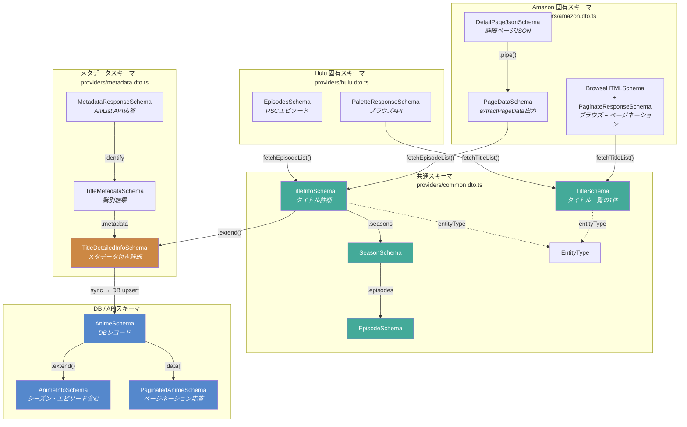

# スキーマアーキテクチャ

プロバイダ固有のAPIレスポンスから共通型への変換、メタデータ付与、DB格納までのデータフローを示す。

## 全体図



## スキーマファイル構成

```
src/schemas/
├── anime.dto.ts                  # DB/APIレイヤーのスキーマ
├── recording.dto.ts              # 録画状態更新のスキーマ
├── message.dto.ts                # キューメッセージのスキーマ
└── providers/
    ├── common.dto.ts             # 全プロバイダ共通の型
    ├── metadata.dto.ts           # AniList/TMDB メタデータ
    ├── amazon.dto.ts             # Amazon Prime Video 固有
    └── hulu.dto.ts               # Hulu 固有
```

## レイヤー別の役割

### 1. プロバイダ固有スキーマ (`providers/amazon.dto.ts`, `providers/hulu.dto.ts`)

各プロバイダのAPI/HTMLレスポンスをパースするためのスキーマ。プロバイダごとにレスポンス構造が異なるため、個別に定義する。

| Amazon | 用途 |
|--------|------|
| `BrowseHTMLSchema` | ブラウズページ埋め込みJSONのパース → `Title[]` に transform |
| `DetailPageJsonSchema` | 詳細ページ埋め込みJSONのパース → `PageData` に pipe |
| `PageDataSchema` | `extractPageData()` の出力型 |
| `PaginateResponseSchema` | ページネーションAPIのレスポンス |
| `BrowseQuerySchema` | ブラウズ URL 生成時の検索クエリ |

| Hulu | 用途 |
|------|------|
| `PaletteResponseSchema` | Palette API (ブラウズ) のレスポンス |
| `EpisodesSchema` | RSCペイロードから抽出したエピソード配列 |
| `VodItemSchema` | ブラウズAPIの個別アイテム |

### 2. 共通スキーマ (`providers/common.dto.ts`)

全プロバイダが最終的に変換する統一型。`Provider` 基底クラスのインターフェースで使用される。

| スキーマ | 用途 |
|----------|------|
| `EntityType` | `'tv' \| 'movie'` の enum |
| `TitleSchema` | タイトル一覧の1件（`fetchTitleList()` の戻り値要素） |
| `EpisodeSchema` | エピソード1件 |
| `SeasonSchema` | シーズン（エピソード配列を含む） |
| `TitleInfoSchema` | タイトル詳細（シーズン配列を含む、`fetchEpisodeList()` の戻り値） |
| `TitleStatusTypeEnum` | 放送状態（`FINISHED`, `RELEASING` 等） |

### 3. メタデータスキーマ (`providers/metadata.dto.ts`)

AniList/TMDB APIから取得したメタデータと、共通スキーマを合成した詳細型。

| スキーマ | 用途 |
|----------|------|
| `MetadataResponseSchema` | AniList GraphQL API のレスポンス |
| `MetadataMediaSchema` | AniList の作品1件 |
| `TitleMetadataSchema` | 識別結果（aniListId, status, year, quarter） |
| `TitleDetailedInfoSchema` | `TitleInfoSchema` + imageUrl + metadata を合成した完全型 |

### 4. DB/APIスキーマ (`anime.dto.ts`)

Prisma経由でDBに格納された後、Hono APIのレスポンスとして返すスキーマ。

| スキーマ | 用途 |
|----------|------|
| `AnimeSchema` | `anime` テーブルのレコード |
| `AnimeInfoSchema` | AnimeSchema + seasons + episodes のネスト構造 |
| `AnimeListQuerySchema` | 一覧API のクエリパラメータ |
| `PaginatedAnimeSchema` | ページネーション付き一覧レスポンス |

## データフロー

```
[Amazon API/HTML] ──→ Amazon固有スキーマ ──→ Title / TitleInfo (共通)
[Hulu API/RSC]    ──→ Hulu固有スキーマ   ──→ Title / TitleInfo (共通)
                                                    │
                                                    ▼
                                    Provider.fetchTitle()
                                    TitleInfo + MetadataAdapter.identify()
                                                    │
                                                    ▼
                                          TitleDetailedInfo (メタデータ付き)
                                                    │
                                                    ▼
                                          SyncService → Prisma upsert
                                                    │
                                                    ▼
                                          AnimeSchema (DB/APIレスポンス)
```
