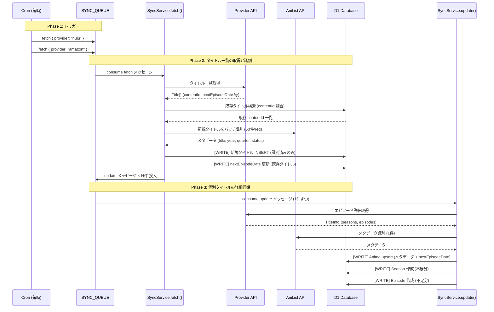

# Sync Queue

Cloudflare Workers の Queue を使ったバックグラウンド同期処理。

## 全体フロー



## DB 書き込みタイミング

| Phase | タイミング | 対象テーブル | 操作 |
|---|---|---|---|
| fetch | AniList 識別成功時 | `anime` | 新規タイトルを INSERT (browse 情報 + メタデータ) |
| fetch | `badge_text_end_at` を持つ既存タイトルに対して | `anime` | `nextEpisodeDate` を UPDATE |
| update | メタデータ取得後 | `anime` | upsert (title, status, year, quarter, nextEpisodeDate 等) |
| update | シーズン差分比較後 | `seasons` | 不足分を INSERT |
| update | エピソード差分比較後 | `episodes` | 不足分を INSERT |

## 処理詳細

### 1. Scheduled Trigger (Cron)

毎時 `0 */1 * * *` に実行。各プロバイダの `fetch` メッセージをキューに投入する。

```
scheduled() → SYNC_QUEUE.send({ type: "fetch", message: { provider: "hulu" } })
             SYNC_QUEUE.send({ type: "fetch", message: { provider: "amazon" } })
```

### 2. fetch — タイトル一覧の取得と識別

プロバイダからタイトル一覧を取得し、AniList でバッチ識別する。

1. プロバイダの `fetchTitleList({ newEpisodesOnly: true })` を呼ぶ
   - **Hulu**: `recentlyadded-anime` パレット + 今期（最終月なら来期も）パレットを並列取得
   - **Amazon**: browse ページから取得
2. DB の既存タイトルと差分比較
3. 新規タイトルを AniList でバッチ識別（50件ずつ、1バッチ = 1 API リクエスト）
4. **DB書き込み**: 識別済みの新規タイトルを INSERT（browse 情報 + AniList メタデータ）
5. **DB書き込み**: Hulu の `badge_text_end_at` から `nextEpisodeDate` を既存タイトルに反映
6. 識別済み contentId リストを `update` メッセージとしてキューに投入

### 3. update — 個別タイトルの詳細同期

1件のタイトルについてエピソード情報を取得し、DB に同期する。

1. プロバイダの `fetchTitleDetailedInfo(contentId)` を呼ぶ
   - Falcor/RSC (Hulu) or Detail API (Amazon) でエピソード一覧取得
   - AniList で個別識別（1リクエスト）
2. `nextEpisodeDate` をエピソードの未来の `releaseDate` から算出
3. **DB書き込み**: Anime を upsert（メタデータ・`nextEpisodeDate` 含む）
4. **DB書き込み**: Season/Episode の差分同期（不足分のみ INSERT）

## メッセージ形式

### fetch

```json
{
  "type": "fetch",
  "message": {
    "provider": "hulu"
  }
}
```

| フィールド | 型 | 説明 |
|---|---|---|
| `type` | `"fetch"` | 固定値 |
| `message.provider` | `"amazon" \| "hulu"` | プロバイダ名 |

### update

```json
{
  "type": "update",
  "message": {
    "provider": "hulu",
    "contentId": "dandadan"
  }
}
```

| フィールド | 型 | 説明 |
|---|---|---|
| `type` | `"update"` | 固定値 |
| `message.provider` | `"amazon" \| "hulu"` | プロバイダ名 |
| `message.contentId` | `string` | コンテンツ ID (Hulu: slug, Amazon: titleID) |

## Queue 設定 (wrangler.toml)

```toml
[[queues.producers]]
binding = "SYNC_QUEUE"
queue = "anime-tracker-sync-staging"

[[queues.consumers]]
queue = "anime-tracker-sync-staging"
max_batch_size = 5
max_retries = 3
```

## ローカルテスト

`bun dev` 起動中にデバッグエンドポイントで直接実行できる（キューを経由しない）。

```bash
# fetch: タイトル一覧取得
curl -X POST http://localhost:15173/api/debug/sync \
  -H 'Content-Type: application/json' \
  -d '{"type":"fetch","message":{"provider":"hulu"}}'

# update: 個別タイトル同期
curl -X POST http://localhost:15173/api/debug/sync \
  -H 'Content-Type: application/json' \
  -d '{"type":"update","message":{"provider":"hulu","contentId":"akane-banashi"}}'
```
