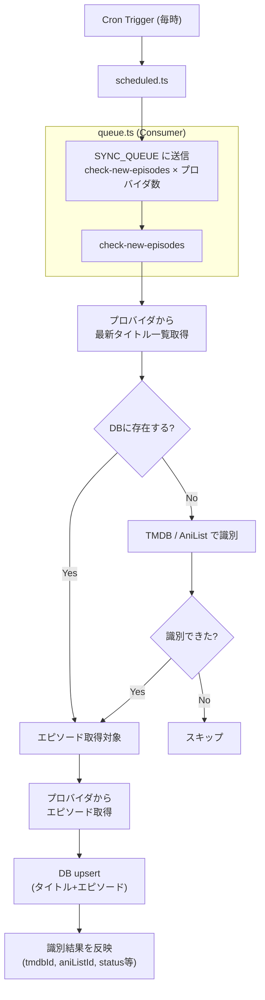
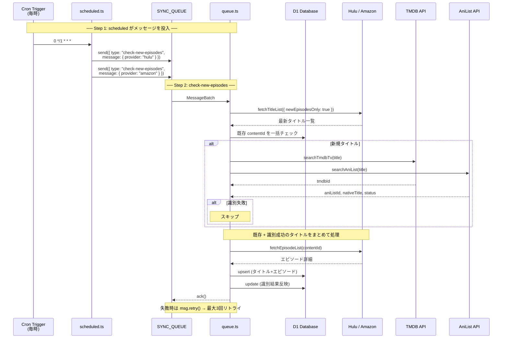

# Sync Queue アーキテクチャ

## 全体フロー

## シーケンス図

## キュー設定

| 項目 | 値 |
|---|---|
| キュー名 | `anime-tracker-sync-{staging\|production}` |
| バインディング | `SYNC_QUEUE` |
| 最大バッチサイズ | 5 |
| 最大リトライ回数 | 3 |
| Cron スケジュール | `0 */1 * * *`（毎時） |

## メッセージタイプ

| type | 概要 | 外部API |
|---|---|---|
| `check-new-episodes` | プロバイダから最新タイトル一覧を取得し、既存はエピソード更新、新規はTMDB/AniListで識別後に追加 | Hulu / Amazon + TMDB + AniList |

## 手動実行

`POST /api/sync` でキューにメッセージを直接投入できる。詳細は [sync-queue-api.md](sync-queue-api.md) を参照。
