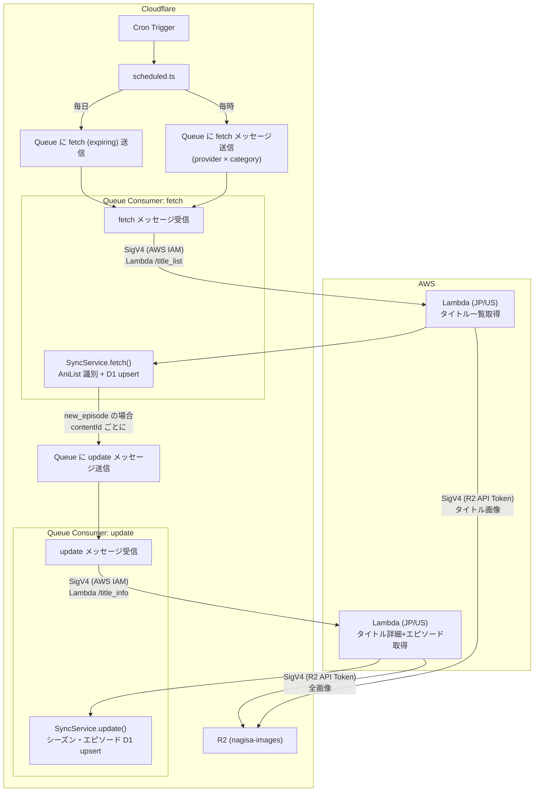
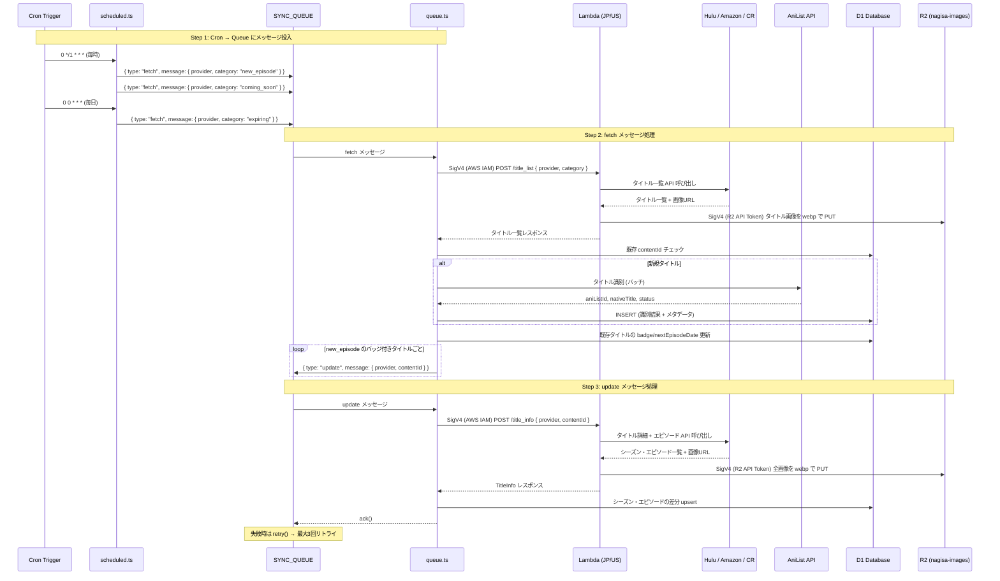
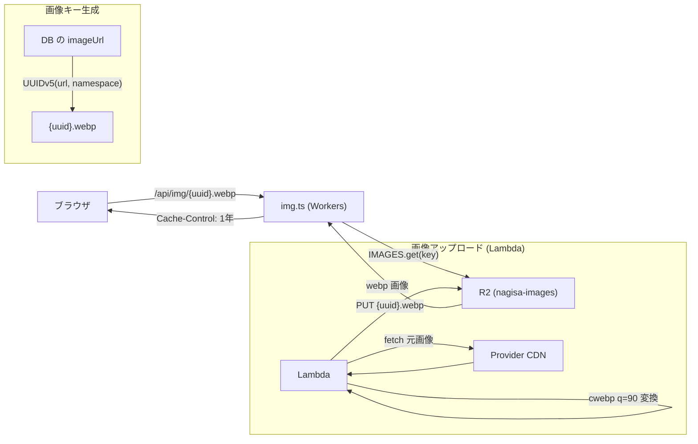

# Sync Queue アーキテクチャ

## 概要

Cloudflare Workers (Cron Trigger) → Queue → Lambda (日本/US IP) → D1 + R2 のパイプラインで、各プロバイダのタイトル・エピソード情報を定期取得する。

## 全体フロー

### 認証が必要な箇所

| 通信経路 | 認証方式 | 認証情報 |
|---|---|---|
| Workers → Lambda Function URL | AWS SigV4 署名 | `AWS_ACCESS_KEY_ID` / `AWS_SECRET_ACCESS_KEY` (LambdaInvoker IAM User) |
| Lambda → R2 S3 互換 API | AWS SigV4 署名 | `R2_IMAGE_ACCESS_KEY_ID` / `R2_IMAGE_SECRET_ACCESS_KEY` (R2 API Token) |
| Workers → R2 | Workers バインディング | 認証不要 (同一アカウント内、`IMAGES` バインディング) |
| Workers → D1 | Workers バインディング | 認証不要 (同一アカウント内、`DB` バインディング) |
| Lambda → Provider API | なし / 公開 API | 認証不要 |

## シーケンス図

## 画像配信フロー

## キュー設定

| 項目 | 値 |
|---|---|
| キュー名 | `anime-tracker-sync-{staging\|production}` |
| バインディング | `SYNC_QUEUE` |
| 最大バッチサイズ | 5 |
| 最大リトライ回数 | 3 |

## Cron スケジュール

| Cron | 頻度 | 処理内容 |
|---|---|---|
| `0 */1 * * *` | 毎時 | `new_episode` + `coming_soon` を各プロバイダで取得 |
| `0 0 * * *` | 毎日 | `expiring` を各プロバイダで取得 |

## メッセージタイプ

| type | 概要 | Lambda エンドポイント |
|---|---|---|
| `fetch` | タイトル一覧取得 → AniList 識別 → D1 登録 → update キュー投入 | `/title_list`, `/expiring` |
| `update` | タイトル詳細+エピソード取得 → D1 差分更新 → 画像 R2 アップロード | `/title_info` |

## Lambda エンドポイント

| パス | 処理 | リージョン |
|---|---|---|
| `POST /title_list` | タイトル一覧取得 + タイトル画像 R2 アップロード | JP (Amazon/Hulu), US (Crunchyroll) |
| `POST /title_info` | タイトル詳細+エピソード取得 + 全画像 R2 アップロード | JP (Amazon/Hulu), US (Crunchyroll) |
| `POST /expiring` | 配信終了間近タイトル取得 | JP |

## R2 画像ストレージ

| 項目 | 値 |
|---|---|
| バケット名 | `nagisa-images` |
| キー形式 | `{UUIDv5(imageUrl)}.webp` (フラット構造) |
| UUIDv5 namespace | `uuidv5('animetracker', DNS)` |
| 画像形式 | webp (q=90) |
| Workers バインディング | `IMAGES` (読み取り専用) |
| Lambda からのアクセス | R2 S3 互換 API (aws4fetch) |

## 手動実行

`POST /api/queues` でキューを経由せず SyncService を直接実行できる。詳細は [sync-queue-api.md](sync-queue-api.md) を参照。
